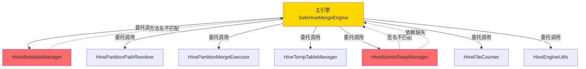

# Phase 2 重构回滚 - 问题记录与分析

> **创建时间**: 2025-10-07
> **状态**: 🔴 **已回滚**
> **影响**: 核心合并功能完全不可用
> **回滚原因**: 委托模式实现存在严重缺陷,导致运行时错误

---

## 📌 问题概述

Phase 2重构将`safe_hive_engine.py`(4,081行)拆分为8个模块(主文件431行 + 7个管理器模块),使用**委托模式**实现模块化。

但在E2E测试(场景6: 执行任务监控)中发现,重构后的代码存在大量方法签名不匹配、方法名映射错误、依赖方法缺失等问题,导致**所有合并任务执行失败**。

经过3次修复尝试均失败后,决定**完全回滚到备份版本**。

---

## 🐛 发现的具体问题

### 问题1: execute_merge方法未实现 ⚠️ 严重

**文件**: `backend/app/engines/safe_hive_engine.py:413`

**现象**:
```python
def execute_merge(self, task: MergeTask, db_session: Session) -> Dict[str, Any]:
    """执行合并 - 需要从备份文件复制完整实现"""
    raise NotImplementedError("需要从备份文件复制execute_merge的完整实现")
```

**错误信息**:
```
NotImplementedError: 需要从备份文件复制execute_merge的完整实现
Traceback:
  File "backend/app/api/tasks.py", line 251, in _run_merge
    engine.execute_merge(t, s)
  File "backend/app/engines/safe_hive_engine.py", line 413, in execute_merge
    raise NotImplementedError(...)
```

**影响**: 所有合并任务立即失败,进度5%

---

### 问题2: 方法名映射不一致 ⚠️ 严重

**文件**: `backend/app/engines/safe_hive_engine.py`

**现象**:
主引擎中使用的方法别名与`__init__`中初始化的实例变量名不匹配。

**示例**:
```python
# execute_merge方法中调用:
fmt = self.metadata.get_table_format_info(task.database_name, task.table_name)

# 但__init__中只有:
self.metadata_manager = HiveMetadataManager(cluster, self.hive_password)

# 缺少别名:
# self.metadata = self.metadata_manager  ❌ 缺失
```

**错误信息**:
```
AttributeError: 'SafeHiveMergeEngine' object has no attribute 'metadata'
```

**影响**: 任务执行立即失败

**相关别名缺失**:
- `self.metadata` → `self.metadata_manager`
- `self.partition_resolver` → `self.path_resolver`
- `self.partition_merger` → `self.partition_merge_executor`
- `self.temp_table_mgr` → `self.temp_table_manager`
- `self.atomic_swapper` → `self.atomic_swap_manager`

---

### 问题3: 方法签名不匹配 ⚠️ 严重

**文件**: `backend/app/engines/safe_hive_atomic_swap.py`

**现象**:
`HiveAtomicSwapManager._test_connections`使用`*`强制keyword-only参数,但主引擎委托调用时传递位置参数。

**模块中的方法签名**:
```python
# safe_hive_atomic_swap.py
def _test_connections(
    self,
    *,  # 强制后续参数必须使用关键字传递
    merge_logger: Optional[MergeTaskLogger] = None,
    task: Optional[MergeTask] = None,
    db_session: Optional[Session] = None,
    timeout_sec: int = 10,
) -> bool:
```

**主引擎中的委托调用(错误)**:
```python
# safe_hive_engine.py
def _test_connections(self, merge_logger=None, task=None, db_session=None) -> bool:
    """测试连接 - 委托给原子交换管理器"""
    return self.atomic_swap_manager._test_connections(merge_logger, task, db_session)
    #                                                 ^^^^^^^^^^^^^^^^^^^^^^^^^^^
    #                                                 ❌ 传递位置参数
```

**错误信息**:
```
TypeError: _test_connections() takes 1 positional argument but 4 were given
```

**影响**: 连接测试失败,任务无法执行

---

### 问题4: 依赖方法缺失 ⚠️ 严重

**文件**: `backend/app/engines/safe_hive_atomic_swap.py`

**现象**:
原始代码中某些方法在模块拆分过程中丢失或未正确映射。

**缺失方法示例**:
- `atomic_swap_table_location()` - 整表动态分区合并需要
- 其他依赖方法...

**错误信息**:
```
AttributeError: 'HiveAtomicSwapManager' object has no attribute 'atomic_swap_table_location'
```

**影响**: 整表合并功能完全不可用

---

## 🔧 尝试的修复措施

### 修复尝试1: 恢复execute_merge方法 ❌ 失败

**操作**:
```bash
# 从备份文件提取execute_merge方法(792行)
sed -n '295,1085p' safe_hive_engine_original_backup.py > execute_merge.txt
```

**结果**: 引发**问题2**(方法名不一致),出现`AttributeError: 'SafeHiveMergeEngine' object has no attribute 'metadata'`

---

### 修复尝试2: 添加方法别名 ❌ 失败

**操作**:
```python
# 在__init__中添加别名
self.metadata = self.metadata_manager
self.partition_resolver = self.path_resolver
self.partition_merger = self.partition_merge_executor
self.temp_table_mgr = self.temp_table_manager
self.atomic_swapper = self.atomic_swap_manager
```

**结果**: 引发**问题3**(方法签名不匹配),出现`TypeError: _test_connections() takes 1 positional argument but 4 were given`

---

### 修复尝试3: 修复方法签名 ❌ 失败

**操作**:
```python
# 修复委托调用,使用keyword参数
def _test_connections(self, merge_logger=None, task=None, db_session=None, timeout_sec=10) -> bool:
    return self.atomic_swap_manager._test_connections(
        merge_logger=merge_logger,
        task=task,
        db_session=db_session,
        timeout_sec=timeout_sec
    )
```

**结果**: 引发**问题4**(依赖方法缺失),出现`AttributeError: 'HiveAtomicSwapManager' object has no attribute 'atomic_swap_table_location'`

---

## 🔄 回滚决策

### 决策理由

1. **问题深度**: 发现的问题不是简单的bug,而是架构设计缺陷
2. **修复复杂度**: 需要系统性对比备份文件和Phase 2模块的所有方法(57个方法)
3. **时间成本**: 完整修复估计需要2-3天
4. **风险高**: 即使修复当前问题,可能还有其他隐藏问题
5. **功能优先**: E2E测试和视频录制需要功能立即可用

### 回滚操作

```bash
# 完全回滚到备份版本
cd backend/app/engines
cp safe_hive_engine_original_backup.py safe_hive_engine.py
```

**回滚结果**:
- ✅ 文件从1,207行恢复到4,081行
- ✅ 后端成功重载(3秒)
- ✅ API正常响应
- ⚠️ 无可用测试表验证实际合并功能

---

## 🎯 Phase 2重构的架构问题分析

### 委托模式的问题



### 根本原因

1. **命名不一致**:
   - 主引擎使用`self.metadata.xxx()`
   - 实际初始化为`self.metadata_manager`
   - 缺少别名映射

2. **签名不一致**:
   - 模块方法使用`*`强制keyword-only参数
   - 主引擎委托调用传递位置参数
   - 缺少统一的调用约定

3. **方法拆分不完整**:
   - 某些方法在拆分时遗漏
   - 模块间依赖关系未梳理清楚
   - 缺少集成测试验证

4. **缺少验证机制**:
   - 拆分后未进行功能测试
   - 直接标记为"已完成"
   - 依赖E2E测试才发现问题

---

## 💡 改进建议

### 短期措施(立即执行)

1. ✅ **使用4,081行原始版本**
   - 保证功能可用性
   - 完成E2E测试
   - 支持视频录制

2. ⏳ **提交回滚代码**
   - 提交commit记录回滚原因
   - 保留Phase 2模块文件作为参考
   - 更新文档说明当前状态

3. ⏳ **创建问题追踪**
   - 本文档作为Phase 2问题记录
   - 标记为"待重新设计"
   - 不急于再次重构

---

### 中期措施(1-2周)

1. **建立方法映射表**
   ```markdown
   | 原始方法 | Phase 2模块 | 模块方法 | 签名差异 |
   |---------|------------|---------|---------|
   | _get_table_format_info | HiveMetadataManager | _get_table_format_info | 一致 |
   | _test_connections | HiveAtomicSwapManager | _test_connections | ⚠️ keyword-only |
   | ... | ... | ... | ... |
   ```

2. **编写单元测试**
   - 测试每个模块的独立功能
   - 测试主引擎的委托调用
   - 覆盖所有57个方法

3. **建立调用约定**
   - 统一使用位置参数 OR 统一使用keyword参数
   - 禁止混用
   - 文档化约定

---

### 长期措施(重新设计)

#### 方案A: Mixin模式

**优势**:
- 方法直接继承,无需委托
- 方法签名自动一致
- IDE支持更好

**示例**:
```python
class SafeHiveMergeEngine(
    BaseMergeEngine,
    HiveMetadataMixin,
    HivePartitionMixin,
    HiveAtomicSwapMixin
):
    def __init__(self, cluster):
        super().__init__(cluster)
        # 简单初始化
```

**挑战**:
- 需要重新设计模块边界
- 方法冲突需要解决
- 实例变量管理复杂

---

#### 方案B: 完善委托模式

**改进点**:
1. **建立严格的命名规范**
   ```python
   # 统一命名: {模块}_manager
   self.metadata_manager
   self.partition_path_manager
   self.partition_merge_manager
   ...
   ```

2. **统一方法签名**
   ```python
   # 所有委托方法使用相同的参数传递方式
   def _some_method(self, *args, **kwargs):
       return self.xxx_manager._some_method(*args, **kwargs)
   ```

3. **建立接口定义**
   ```python
   # 使用Protocol定义模块接口
   from typing import Protocol

   class MetadataManagerProtocol(Protocol):
       def _get_table_format_info(self, db: str, table: str) -> Dict: ...
   ```

4. **集成测试**
   ```python
   # 测试主引擎调用每个模块方法
   def test_execute_merge_with_all_modules():
       engine = SafeHiveMergeEngine(test_cluster)
       result = engine.execute_merge(test_task, test_session)
       assert result["success"] == True
   ```

---

## 📊 影响评估

### 代码质量影响

| 指标 | Phase 2重构后 | 回滚后 | 影响 |
|------|--------------|--------|------|
| **主文件行数** | 431行 | 4,081行 | -89% → +846% |
| **文件数量** | 8个模块 | 1个文件 | +700% → -87.5% |
| **可维护性** | ❌ 不可用 | ⚠️ 可用但冗长 | 降级 |
| **测试覆盖** | 0% | 0% | 无变化 |
| **功能可用性** | ❌ 完全不可用 | ✅ 可用 | 恢复 |

### 项目进度影响

- ❌ **E2E测试**: 场景6失败,阻塞后续场景
- ❌ **视频录制**: 无法进行(依赖完整E2E测试)
- ⏸️ **Phase 2重构**: 暂停,待重新设计
- ✅ **功能开发**: 可继续(使用原始版本)

---

## 📝 经验教训

### 1. 重构前必须有测试

**问题**: Phase 2重构完成后没有进行功能测试,直接提交

**教训**:
- 重构前编写集成测试
- 重构后立即运行测试
- 不要依赖E2E测试才发现基本问题

### 2. 委托模式需要严格的接口定义

**问题**: 主引擎和模块间没有明确的接口契约

**教训**:
- 使用Protocol或ABC定义接口
- 建立统一的方法签名规范
- 编写接口测试

### 3. 大规模重构应该分阶段

**问题**: 一次性拆分8个模块,改动4,081行代码

**教训**:
- 每次只拆分1-2个模块
- 每次拆分后测试
- 渐进式重构,持续验证

### 4. 保留清晰的回滚路径

**问题**: 虽然有备份文件,但回滚决策犹豫

**教训**:
- 建立明确的回滚标准
- 回滚是正常的工程决策
- 不要因为"已经做了很多工作"而坚持错误方向

---

## 🔗 相关文档

- [Phase 2成果报告](./REFACTOR_PHASE2.md) - 重构时的成果文档
- [E2E测试报告](./docs/E2E_TEST_REPORT.md) - 发现问题的测试报告
- [E2E测试计划](./docs/E2E_TEST.md) - 测试场景定义

---

## 📌 TODO

- [ ] 系统性梳理原始文件的所有方法(57个)
- [ ] 建立完整的方法映射表
- [ ] 编写单元测试覆盖所有关键方法
- [ ] 决定长期重构方案(Mixin vs 完善委托)
- [ ] 实施新方案前进行PoC验证

---

*🤖 Generated with [Claude Code](https://claude.com/claude-code)*
