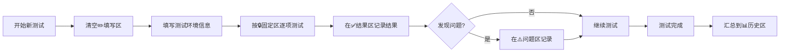

# 功能测试清单

> **文档版本**: v2.0
> **最后更新**: 2025-10-21
> **适用对象**: 开发/测试人员进行功能验收

---

## 📚 文档使用说明

### 🎯 本文档的目的

这是一个**可重复使用的测试清单**，用于：
- 新版本发布前的功能验收
- 定期回归测试
- 问题排查参考

### 📖 文档区域说明

本文档分为 **5个区域**，每个区域有不同的使用规则：

| 区域 | 标记 | 说明 | 操作规则 |
|------|------|------|----------|
| **固定区** | 🔒 | 测试检查项清单 | ⚠️ 需团队审核才可修改 |
| **填写区** | ✏️ | 每次测试的环境信息 | 🔄 每次测试前清空重填 |
| **结果区** | ✅ | 测试执行结果记录 | ➕ 每次测试后追加，不删除 |
| **问题区** | ⚠️ | 当前未解决的问题 | 🔄 解决后删除或标记已解决 |
| **历史区** | 📊 | 历史测试汇总 | 🗑️ 保留最近2-3次，定期清理 |

### 🔄 使用流程



### ✍️ 操作指南

**开始新测试前**：
1. 清空 `✏️ 填写区` 的内容
2. 重置 `🔒 固定区` 所有复选框为 `[ ]`

**测试执行中**：
1. 填写 `✏️ 填写区` 的环境信息
2. 参照 `🔒 固定区` 逐项执行测试
3. 勾选通过的项 `[x]`，失败的保持 `[ ]`
4. 在 `✅ 结果区` 追加本次测试记录
5. 发现问题时在 `⚠️ 问题区` 记录

**测试完成后**：
1. 在 `📊 历史区` 添加本次测试汇总
2. 保留最近 2-3 次测试记录
3. 删除 3 次前的旧记录

---

## 🔒 第一部分：固定测试清单

> ⚠️ **注意**: 此部分为固定模板，修改需经团队审核
> 最后修改: 2025-10-21

### 一、环境与前置条件

#### 1.1 环境确认

- [ ] **测试环境类型已明确**
  - Demo 模式（无 Hive/HDFS）
  - 预生产环境
  - 生产环境

- [ ] **测试集群信息已记录**（见下方填写区）

#### 1.2 环境检查

- [ ] **运行环境**
  - [ ] Python 版本 ≥ 3.10
  - [ ] Node 版本 ≥ 20
  - [ ] Docker（可选）

- [ ] **配置文件**
  - [ ] `backend/.env` 已配置
  - [ ] `frontend/.env` 已配置
  - [ ] 确认未提交密钥信息

- [ ] **依赖安装**
  - [ ] 后端依赖：`pip install -r requirements.txt`
  - [ ] 前端依赖：`npm install`（如需要）

- [ ] **服务启动**
  - [ ] 后端服务运行于 http://localhost:8000
  - [ ] 前端服务运行于 http://localhost:5173

#### 1.3 服务验证

- [ ] `curl http://localhost:8000/health` 返回 `status=healthy`
- [ ] `curl http://localhost:8000/` 返回平台标识
- [ ] `curl http://localhost:8000/api/v1/clusters/` 返回集群列表
- [ ] http://localhost:8000/docs 可访问（Swagger UI）
- [ ] http://localhost:5173 可访问（前端页面）

### 二、后端 API 基础验证

- [ ] **GET `/`** 返回平台标识信息
  - 预期响应: `{"message": "Hive Small File Management Platform API"}`

- [ ] **GET `/health`** 返回健康状态
  - 预期响应: `{"status": "healthy", "server_config": {...}}`

- [ ] **CORS 验证**
  - [ ] 前端地址在允许列表内
  - [ ] 可正常调用 API（无跨域错误）

### 三、集群管理 API（/api/v1/clusters）

#### 3.1 列表与查询

- [ ] `GET /api/v1/clusters/` 返回集群数组
- [ ] `GET /api/v1/clusters/{id}` 存在时返回 200
- [ ] `GET /api/v1/clusters/{id}` 不存在时返回 404

#### 3.2 创建与更新

- [ ] `POST /api/v1/clusters?validate_connection=false` 成功创建
- [ ] 非法 URL 被拒绝（返回 400）
- [ ] `validate_connection=true` 时，MetaStore 失败返回 400
- [ ] `validate_connection=true` 时，HDFS 失败仍可创建（警告）
- [ ] `PUT /api/v1/clusters/{id}` 部分字段更新成功

#### 3.3 统计与健康检查

- [ ] `GET /api/v1/clusters/{id}/stats` 返回完整统计
  - 包含: database count, table count, small files count
- [ ] `GET /api/v1/clusters/health-metrics?days=7` 正常返回
  - 有效范围: 1-90 天
- [ ] `POST /api/v1/clusters/batch-health-check` 返回成功/失败计数

#### 3.4 连接测试

- [ ] `POST /api/v1/clusters/{id}/test?mode=mock` 模拟测试通过
- [ ] `POST /api/v1/clusters/{id}/test?mode=real` 真实连接测试
- [ ] `force_refresh=true/false` 行为符合预期

### 四、表与扫描功能

#### 4.1 表指标与小文件

- [ ] `GET /api/v1/tables/metrics` 返回结构正确
- [ ] `GET /api/v1/tables/small-files` 返回结构正确
- [ ] `GET /api/v1/tables/databases/{cluster_id}` 可用
- [ ] `GET /api/v1/tables/tables/{cluster_id}/{database}` 可用

#### 4.2 扫描任务

- [ ] **触发扫描**
  - [ ] `POST /api/v1/table-scanning/scan` 全量扫描
  - [ ] `POST /api/v1/table-scanning/scan/{cluster}` 集群扫描
  - [ ] `POST /api/v1/table-scanning/scan/{cluster}/{db}` 数据库扫描
  - [ ] `POST /api/v1/table-scanning/scan-table/{cluster}/{db}/{table}` 表扫描

- [ ] **进度查询**
  - [ ] `GET /api/v1/scan-tasks/scan-progress/{task_id}` 进度更新正常
  - [ ] `GET /api/v1/scan-tasks/scan-logs/{task_id}` 日志可见

### 五、冷数据与表归档

#### 5.1 冷数据扫描

- [ ] `POST /api/v1/table-archiving/scan-cold-data/{cluster}` 扫描成功
- [ ] `GET /api/v1/table-archiving/cold-data-summary/{cluster}` 摘要正确

#### 5.2 表归档/恢复

- [ ] `POST /api/v1/table-archiving/archive-with-progress/{cluster}/{db}/{table}` 归档成功
- [ ] `POST /api/v1/table-archiving/restore-with-progress/{cluster}/{db}/{table}` 恢复成功
- [ ] 状态、列表与统计接口可用

#### 5.3 分区归档

- [ ] 分区扫描接口正常
- [ ] 批量归档接口正常
- [ ] 统计与分布接口返回合理数据

### 六、存储管理（/api/v1）

- [ ] **纠删码策略**
  - [ ] `POST /api/v1/ec/set-policy/{cluster_id}` 参数校验正确
  - [ ] 任务提交成功
  - [ ] 结果反馈正确

- [ ] **HDFS 搬迁**
  - [ ] `POST /api/v1/storage/mover/{cluster_id}` 触发成功
  - [ ] 日志可见

- [ ] **副本数设置**
  - [ ] `POST /api/v1/storage/set-replication/{cluster_id}` 生效
  - [ ] 越界值被校验拒绝

### 七、任务中心

- [ ] **任务列表**
  - [ ] `GET /api/v1/tasks` 正常返回
  - [ ] `GET /api/v1/tasks/{task_id}` 详情正确
  - [ ] `GET /api/v1/tasks/stats` 统计数据合理

- [ ] **任务操作**
  - [ ] `POST /api/v1/tasks/{task_id}/execute` 执行成功
  - [ ] `POST /api/v1/tasks/{task_id}/retry` 重试成功
  - [ ] `POST /api/v1/tasks/{task_id}/cancel` 取消成功
  - [ ] 状态流转正确

- [ ] **任务预览**
  - [ ] `GET /api/v1/tasks/{task_id}/preview` 数据格式正确

### 八、WebSocket 实时推送

- [ ] **连接建立**
  - [ ] `ws://{host}/api/v1/ws?user_id=u1&topics=task_updates,scan_progress` 成功握手

- [ ] **心跳机制**
  - [ ] 发送 `{type:"ping"}` 收到 `pong`

- [ ] **订阅管理**
  - [ ] `subscribe` 消息返回确认
  - [ ] `unsubscribe` 消息返回确认

- [ ] **状态查询**
  - [ ] `{type:"get_status"}` 返回连接统计
  - [ ] `GET /api/v1/ws/stats` 统计一致

- [ ] **消息广播**
  - [ ] `POST /api/v1/ws/broadcast` 推送成功
  - [ ] 客户端收到消息

### 九、前端关键路径（手工回归）

- [ ] **Dashboard（概览页）**
  - [ ] 概览指标加载正常
  - [ ] 趋势图表显示正常
  - [ ] 近期任务列表可见
  - [ ] 刷新无报错

- [ ] **集群管理页**
  - [ ] 集群列表显示正常
  - [ ] 创建集群（含校验）功能可用
  - [ ] 健康检查按钮可用
  - [ ] 连接测试操作可见且可用

- [ ] **表管理页**
  - [ ] 数据库/表切换正常
  - [ ] 筛选小文件功能正常
  - [ ] 批量创建任务按钮行为正确

- [ ] **任务管理页**
  - [ ] 任务列表刷新正常
  - [ ] 状态变化显示正确
  - [ ] 日志查看功能正常
  - [ ] WebSocket 推送生效

- [ ] **归档相关页**
  - [ ] 扫描操作可执行
  - [ ] 归档/恢复流程可操作
  - [ ] 进度显示可见

### 十、通过标准与记录

- [ ] **代码质量**
  - [ ] `make check` 通过
  - [ ] `make test` 通过
  - [ ] 后端测试覆盖率 ≥ 75%

- [ ] **功能验收**
  - [ ] 关键用例（第二至九部分）100% 通过
  - [ ] 失败项已记录（见问题区）

- [ ] **文档记录**
  - [ ] UI 变更已附截图/录屏
  - [ ] WebSocket 用例已附事件摘录
  - [ ] 问题已记录在问题区

---

## ✏️ 第二部分：本次测试信息

> 🔄 **每次测试前清空此区域，重新填写**

### 测试基本信息

- **测试日期**: ___________________
- **测试人员**: ___________________
- **测试目的**: ___________________
- **环境类型**: [ ] Demo [ ] 预生产 [ ] 生产

### 测试集群信息

```
集群名称: ___________________
集群地址: ___________________
认证方式: ___________________
测试模式: ___________________
```

### 运行环境

```
Python 版本: ___________________
Node 版本: ___________________
操作系统: ___________________
```

### 服务信息

```
后端服务: http://localhost:____
前端服务: http://localhost:____
数据库: ___________________
```

### 备注

```
（记录本次测试的特殊说明，如：
- 测试范围限制
- 已知问题
- 其他注意事项
）
```

---

## ✅ 第三部分：测试结果记录

> ➕ **每次测试后追加记录，不删除历史记录**

### 📅 2025-10-21 测试结果

**测试信息**：
- 日期: 2025-10-21
- 环境: 预生产（CDP-14 集群）
- 测试人员: Claude AI Assistant

**测试进度**: 🟡 进行中（已完成 1/10）

**通过情况**：

#### 一、环境与前置条件 ✅
- [x] 1.1 环境确认
  - 环境类型: 预生产
  - 集群: CDP-14 (192.168.0.105)
  - 认证: LDAP

- [x] 1.2 环境检查
  - Python: 3.10.18 (conda 虚拟环境 `hive-backend`)
  - Node: 20.17.0
  - Docker: 26.1.4
  - backend/.env: ✓
  - frontend/.env: ✓
  - 依赖安装: ✓

- [x] 1.3 服务验证
  - 后端健康检查: ✓ status=healthy
  - API 根路径: ✓ 返回平台标识
  - 集群列表: ✓ 返回 3 个集群
  - Swagger UI: ✓ 可访问
  - 前端页面: ✓ 正常加载

**进程信息**:
- Python uvicorn (PID 26375): ✓ 运行中
- Node vite (PID 27097): ✓ 运行中

#### 二至十、其他部分 ⏳
- 待测试...

---

### 📅 示例：下次测试记录格式

**测试信息**：
- 日期: YYYY-MM-DD
- 环境: ___________
- 测试人员: ___________

**测试进度**:

#### 测试结果
- ...

---

## ⚠️ 第四部分：当前问题列表

> 🔄 **发现问题时记录，解决后删除或标记**

### 🔴 未解决问题

<!-- 无当前未解决问题 -->

### ✅ 已解决问题（可删除）

#### 问题1: Python 3.6 不兼容项目依赖

- **发现日期**: 2025-10-21
- **问题描述**: 系统默认 Python 3.6.8 无法安装 pydantic v2、fastapi 0.104+
- **影响范围**: 环境搭建、服务启动
- **解决方案**: 使用 conda 创建 Python 3.10.18 虚拟环境
  ```bash
  conda create -n hive-backend python=3.10 -y
  conda activate hive-backend
  pip install -r requirements.txt
  ```
- **解决日期**: 2025-10-21
- **状态**: ✅ 已解决，可删除本条

#### 问题2: Kerberos 相关包编译失败

- **发现日期**: 2025-10-21
- **问题描述**: gssapi, krb5 编译失败
- **影响范围**: 无影响（CDP-14 使用 LDAP 认证，不需要 Kerberos）
- **解决方案**: 跳过 Kerberos 包，安装其他核心依赖
- **状态**: ✅ 已确认无影响，可删除本条

---

## 📊 第五部分：历史测试汇总

> 🗑️ **保留最近 2-3 次测试汇总，定期清理旧记录**

### 2025-10 月度总结

**测试次数**: 1 次

**测试日期**:
- 2025-10-21

**整体通过率**: 10% (1/10 部分完成)

**完成情况**:
- ✅ 环境与前置条件: 100%
- ⏳ 其他部分: 待测试

**主要问题**:
- Python 版本兼容性（已解决）
- Kerberos 包编译失败（无影响）

**改进建议**:
1. 建议在 README.md 中明确说明最低 Python 版本要求（3.10+）
2. 建议提供 conda environment.yml 文件
3. 建议在 requirements.txt 中注释 Kerberos 为可选依赖

---

## 📖 附录：常用命令参考

### 环境管理

```bash
# 激活 Python 环境
conda activate hive-backend

# 启动后端服务
cd backend && uvicorn app.main:app --host localhost --port 8000

# 启动前端服务
cd frontend && npm run dev
```

### API 测试命令

```bash
# 健康检查
curl -s http://localhost:8000/health

# 获取平台信息
curl -s http://localhost:8000/

# 获取集群列表
curl -s http://localhost:8000/api/v1/clusters/

# 创建集群（mock 验证）
curl -X POST 'http://localhost:8000/api/v1/clusters/?validate_connection=true' \
  -H 'Content-Type: application/json' \
  -d '{"name":"demo","hive_metastore_url":"sqlite:///test.db","hdfs_namenode_url":"http://nn"}'

# WebSocket 广播测试
curl -X POST 'http://localhost:8000/api/v1/ws/broadcast?topic=task_updates&message_type=info' \
  -H 'Content-Type: application/json' \
  -d '{"data":{"msg":"hello"}}'
```

### 浏览器访问

- **API 文档（Swagger UI）**: http://localhost:8000/docs
- **前端应用**: http://localhost:5173

---

**文档版本历史**:

- v2.0 (2025-10-21): 重构为单一文档结构，按区域分隔
- v1.1 (2025-10-21): 添加文档分类标记（多文档方案）
- v1.0 (2025-10-21): 初始版本
