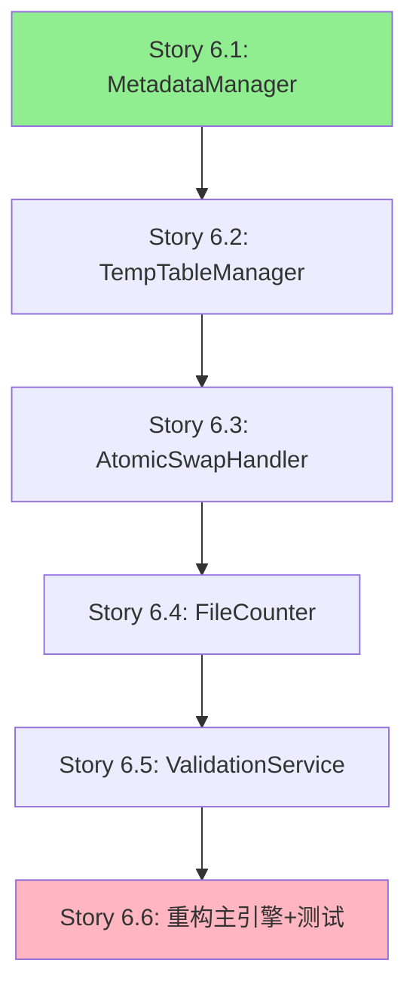

# EPIC-6: 代码重构(技术债治理)

> ⚠️ **已废弃 (DEPRECATED)** - 此版本已暂停执行
>
> **原因**: Story 6.1成功后,发现3个巨型方法(799/409/286行)耦合严重,强行提取模块风险极高
>
> **新版本**: 请查看 [Epic-6 v2.0 渐进式内部重构](./epic-006-refactoring-v2.md)
> **策略调整**: 从"强行提取模块"改为"内部分解方法"
> **创建日期**: 2025-10-12
>
> ---

**Epic ID**: EPIC-6 v1.0 (已废弃)
**Epic名称**: 代码重构和技术债治理
**优先级**: P0 (Critical)
**状态**: ⛔ **已暂停** (Story 6.1完成,6.2-6.6暂停)
**Story数量**: 6 (仅完成1个)
**预计工期**: 2周 (2025-10-12 ~ 2025-10-25)
**负责人**: TBD

**已完成**:
- ✅ Story 6.1: 提取MetadataManager模块 (270行优化)

**已暂停原因**:
- ❌ 发现巨型方法耦合严重,不适合强行提取
- ❌ Story 6.2-6.6风险过高,决定调整策略

---

## 1. Epic概述

### 1.1 业务价值

**当前问题**:
- `safe_hive_engine.py`文件达到4228行,严重违反单文件<500行规范
- 核心模块缺少单元测试,重构风险极高
- 文档滞后,新成员上手困难
- 上一次重构失败(commit 840f29b回滚),技术债累积

**Epic目标**:
- 将safe_hive_engine.py拆分为5个独立模块,每个<900行
- 补充核心模块单元测试,覆盖率达到80%+
- 使用BMAD Brownfield方法论确保重构安全
- 为后续功能开发打下坚实基础

**成功指标**:
- ✅ safe_hive_engine.py从4228行降至<500行
- ✅ 5个新模块独立可测试
- ✅ 所有原有功能100%保留(通过回归测试)
- ✅ 单元测试覆盖率>80%
- ✅ 重构过程零生产事故

---

## 2. 技术债详情

### 技术债-1: safe_hive_engine.py超大文件 (P0)

**问题描述**:
- 文件大小: 165KB, 4228行, 47个方法
- 违反规范: 单文件应<500行
- 影响范围: 合并引擎核心功能
- 上次重构失败原因 (commit 840f29b):
  1. execute_merge未实现(方法体为stub)
  2. 方法名映射不一致(self.metadata vs self.metadata_manager)
  3. 方法签名不匹配(keyword-only参数 vs 位置参数)
  4. 依赖方法缺失(部分方法在拆分过程中遗漏)

**影响**:
- 代码可读性差,维护困难
- 容易引入Bug,重构风险高
- 新成员无法快速理解核心逻辑
- 单元测试难以编写

**拆分方案**:
拆分为5个模块:
1. **MetadataManager** (~900行, 10方法) - 元数据管理
2. **TempTableManager** (~700行, 7方法) - 临时表管理
3. **AtomicSwapHandler** (~600行, 5方法) - 原子交换
4. **FileCounter** (~500行, 7方法) - 文件计数
5. **ValidationService** (~400行, 5方法) - 验证服务

**Epic**: EPIC-6
**截止日期**: 2025-10-20

---

### 技术债-2: 测试覆盖率低 (P1)

**问题描述**:
- 核心模块缺少单元测试
- 集成测试不充分
- 重构时缺少安全网

**影响**:
- 重构容易引入回归Bug
- 无法验证功能完整性
- 生产环境风险高

**计划**:
- 补充核心模块单元测试
- 目标覆盖率: 80%
- 重点覆盖: execute_merge核心流程

**Epic**: EPIC-6 Story 6
**截止日期**: 2025-10-25

---

### 技术债-3: 文档滞后 (P2)

**问题描述**:
- 代码演进快,文档更新滞后
- 部分API缺少docstring
- 运维依赖口头传承

**影响**:
- 新团队成员上手慢
- 知识流失风险高

**计划**:
- 使用BMAD Document Agent补充文档
- 为5个新模块编写完整文档

**截止日期**: 2025-11-01

---

## 3. Story列表

### Story 6.1: 提取MetadataManager模块 ⭐

**优先级**: P0 (Must Do First)
**预计工期**: 2天
**Story描述**:
作为开发者,我希望将元数据管理逻辑提取为独立模块,以便提高代码可维护性。

**验收标准**:
- [ ] 创建`backend/app/engines/safe_hive_metadata_manager.py`
- [ ] 提取10个元数据相关方法:
  - `_get_table_location()`
  - `_table_exists()`
  - `_is_partitioned_table()`
  - `_get_table_partitions()`
  - `_get_table_format_info()`
  - `_get_table_columns()`
  - `_is_unsupported_table_type()`
  - `_unsupported_reason()`
  - `_infer_storage_format_name()`
  - `_infer_table_compression()`
- [ ] 依赖注入HiveMetastoreConnector和PathResolver
- [ ] 保持方法签名100%一致(包括关键字参数)
- [ ] 单元测试覆盖率>80%
- [ ] safe_hive_engine.py成功引入并调用MetadataManager
- [ ] 所有现有测试通过(回归测试)

**关键风险**:
- 方法签名不匹配(上次失败原因)
- 依赖方法遗漏
- execute_merge调用路径破坏

**缓解措施**:
- 使用mypy静态类型检查
- 提取前为execute_merge编写完整集成测试
- 每次提取后运行回归测试

**文档参考**: `/tmp/safe_hive_engine_documented.md` (Section A)

---

### Story 6.2: 提取TempTableManager模块

**优先级**: P0
**预计工期**: 2天
**依赖**: Story 6.1

**Story描述**:
作为开发者,我希望将临时表管理逻辑提取为独立模块,以便简化核心合并流程。

**验收标准**:
- [ ] 创建`backend/app/engines/safe_hive_temp_table.py`
- [ ] 提取7个临时表相关方法:
  - `_generate_temp_table_name()`
  - `_generate_backup_table_name()`
  - `_create_temp_table()`
  - `_create_temp_table_with_logging()`
  - `_validate_temp_table_data()`
  - `_get_temp_table_file_count()`
  - `_execute_sql_with_heartbeat()`
- [ ] 依赖注入MergeTaskLogger和Session
- [ ] 保持_execute_sql_with_heartbeat的YarnMonitor依赖
- [ ] 单元测试覆盖率>80%
- [ ] 回归测试通过

**关键依赖**:
- MetadataManager (已提取)
- YarnResourceManagerMonitor
- MergeTaskLogger

**文档参考**: `/tmp/safe_hive_engine_documented.md` (Section B)

---

### Story 6.3: 提取AtomicSwapHandler模块

**优先级**: P0
**预计工期**: 2天
**依赖**: Story 6.2

**Story描述**:
作为开发者,我希望将原子交换逻辑提取为独立模块,以便确保数据安全性。

**验收标准**:
- [ ] 创建`backend/app/engines/safe_hive_atomic_swap.py`
- [ ] 提取5个原子交换相关方法:
  - `_atomic_table_swap()`
  - `_atomic_table_swap_with_logging()`
  - `_hdfs_rename_with_fallback()`
  - `_rollback_merge()`
  - `_atomic_swap_table_location()`
- [ ] 依赖注入WebHDFSClient和MergeTaskLogger
- [ ] 保持HDFS操作的重试逻辑
- [ ] 单元测试覆盖率>80%
- [ ] 回归测试通过

**关键风险**:
- HDFS操作失败处理
- 回滚逻辑破坏

**文档参考**: `/tmp/safe_hive_engine_documented.md` (Section C)

---

### Story 6.4: 提取FileCounter模块

**优先级**: P0
**预计工期**: 1.5天
**依赖**: Story 6.3

**Story描述**:
作为开发者,我希望将文件计数逻辑提取为独立模块,以便优化扫描性能。

**验收标准**:
- [ ] 创建`backend/app/engines/safe_hive_file_counter.py`
- [ ] 提取7个文件计数相关方法:
  - `_get_file_count()`
  - `_get_file_count_fallback()`
  - `_get_file_count_with_logging()`
  - `_get_partition_hdfs_path()`
  - `_resolve_partition_path()`
  - `_resolve_partition_path_fallback()`
  - `_count_partition_files()`
- [ ] 依赖注入WebHDFSClient和PathResolver
- [ ] 保持降级逻辑(MetaStore -> HDFS -> Fallback)
- [ ] 单元测试覆盖率>80%
- [ ] 回归测试通过

**文档参考**: `/tmp/safe_hive_engine_documented.md` (Section D)

---

### Story 6.5: 提取ValidationService模块

**优先级**: P0
**预计工期**: 1.5天
**依赖**: Story 6.4

**Story描述**:
作为开发者,我希望将验证逻辑提取为独立模块,以便增强数据安全性。

**验收标准**:
- [ ] 创建`backend/app/engines/validation_service.py`
- [ ] 提取5个验证相关方法:
  - `validate_task()`
  - `_validate_partition_filter()`
  - `_test_connections()`
  - `_partition_filter_to_spec()`
  - `_split_or_partition_filter()`
- [ ] 依赖注入WebHDFSClient和HiveMetastoreConnector
- [ ] 保持_test_connections的超时参数(timeout_sec=10)
- [ ] 单元测试覆盖率>80%
- [ ] 回归测试通过

**关键方法签名** (防止上次失败):
```python
def _test_connections(self, merge_logger, task, db_session, timeout_sec=10) -> bool:
    # 注意: timeout_sec是关键字参数,默认值10
```

**文档参考**: `/tmp/safe_hive_engine_documented.md` (Section E)

---

### Story 6.6: 重构safe_hive_engine.py并补充测试 ⭐

**优先级**: P0 (Final Integration)
**预计工期**: 2天
**依赖**: Story 6.1-6.5全部完成

**Story描述**:
作为开发者,我希望重构safe_hive_engine.py为轻量级协调器,并补充完整单元测试。

**验收标准**:
- [ ] safe_hive_engine.py从4228行降至<500行
- [ ] 保留execute_merge方法(协调5个模块)
- [ ] execute_merge的3个分支逻辑100%保留:
  - 分支1: 分区表整表合并 (_execute_full_table_dynamic_partition_merge)
  - 分支2: 分区级合并 (_execute_partition_native_merge)
  - 分支3: 整表合并 (主流程)
- [ ] 显式依赖注入5个模块:
  ```python
  def __init__(self, ...):
      self.metadata_manager = MetadataManager(...)
      self.temp_table_manager = TempTableManager(...)
      self.atomic_swap_handler = AtomicSwapHandler(...)
      self.file_counter = FileCounter(...)
      self.validation_service = ValidationService(...)
  ```
- [ ] 为execute_merge编写完整集成测试
- [ ] 单元测试覆盖率>80%
- [ ] 所有E2E测试通过
- [ ] 生产环境smoke test通过

**关键风险**:
- execute_merge的3个分支可能破坏
- 模块间调用链破坏
- 隐式依赖缺失

**回归测试清单**:
- [ ] 整表合并(非分区表)
- [ ] 分区级合并(指定partition_filter)
- [ ] 分区表整表合并(无partition_filter)
- [ ] 外部表合并(HDFS目录切换)
- [ ] 管理表合并(原子交换)
- [ ] 合并失败回滚
- [ ] 并发合并同一表(锁检测)

**文档参考**: `/tmp/safe_hive_engine_documented.md` (execute_merge详细分析)

---

## 4. 依赖关系图



**关键路径**: Story 6.1 → 6.2 → 6.3 → 6.4 → 6.5 → 6.6 (12天)

---

## 5. 风险和缓解措施

### 风险-1: 重复上次重构失败 (P0, 影响: 高)

**上次失败原因** (commit 840f29b):
1. execute_merge未实现
2. 方法名映射不一致
3. 方法签名不匹配
4. 依赖方法缺失

**缓解措施**:
- ✅ 已创建`/tmp/safe_hive_engine_documented.md`完整文档
- ✅ 严格遵循方法签名(使用mypy检查)
- ✅ 提取前编写execute_merge集成测试
- ✅ 每次提取后运行回归测试
- ✅ 使用BMAD QA Agent进行风险评估和测试设计

---

### 风险-2: 生产环境回归Bug (P0, 影响: 极高)

**概率**: 中
**缓解措施**:
- 完整的回归测试套件(7个场景覆盖)
- 生产环境分阶段发布(灰度10% → 50% → 100%)
- 回滚预案(保留原safe_hive_engine.py备份)
- 监控告警(Sentry + Prometheus)

---

### 风险-3: 重构工期延误 (P1, 影响: 中)

**概率**: 中
**缓解措施**:
- 严格按Story顺序执行,避免并行
- 每个Story 2天工期,留有20%缓冲
- 优先保证功能完整性,可适当延后测试补充

---

## 6. 交付物

### 代码交付
- [ ] `backend/app/engines/safe_hive_metadata_manager.py`
- [ ] `backend/app/engines/safe_hive_temp_table.py`
- [ ] `backend/app/engines/safe_hive_atomic_swap.py`
- [ ] `backend/app/engines/safe_hive_file_counter.py`
- [ ] `backend/app/engines/validation_service.py`
- [ ] `backend/app/engines/safe_hive_engine.py` (重构后<500行)
- [ ] 单元测试文件(每个模块对应的test_*.py)

### 文档交付
- [ ] 5个模块的API文档(docstring完整)
- [ ] 重构总结报告
- [ ] 回归测试报告

### 质量门禁
- [ ] 所有单元测试通过
- [ ] 代码覆盖率>80%
- [ ] E2E测试通过
- [ ] Mypy静态检查通过
- [ ] Pre-commit Hook通过

---

## 7. 成功标准

### 功能完整性
- ✅ 所有原有功能100%保留
- ✅ execute_merge的3个分支逻辑完整
- ✅ 合并策略(CONCATENATE/INSERT OVERWRITE)正常工作
- ✅ 原子交换和回滚逻辑正常

### 代码质量
- ✅ safe_hive_engine.py从4228行降至<500行
- ✅ 5个新模块每个<900行
- ✅ 单元测试覆盖率>80%
- ✅ 无代码重复(DRY原则)

### 生产验证
- ✅ 在开发环境完整回归测试通过
- ✅ 在生产环境灰度发布无异常
- ✅ 监控指标正常(错误率/响应时间)

---

## 8. 参考资料

- **重构失败分析**: Git commit 840f29b
- **方法签名文档**: `/tmp/safe_hive_engine_documented.md`
- **BMAD Brownfield指南**: `.bmad-core/working-in-the-brownfield.md`
- **测试规范**: `docs/architecture.md` 第9章

---

**Epic负责人**: TBD
**创建时间**: 2025-10-12
**最后更新**: 2025-10-12
**下次评审**: Sprint Planning (每周一)
