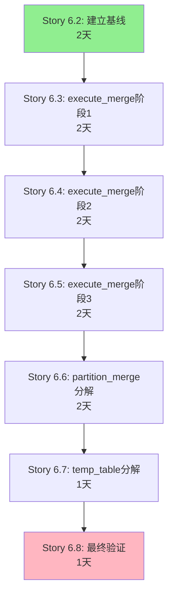

# Epic-6 v2.0 渐进式内部重构 - Brownfield Enhancement PRD

**版本**: v2.0
**创建日期**: 2025-10-12
**PRD类型**: Brownfield Enhancement (技术债治理)
**作者**: BMAD PM (John)
**BMAD版本**: v4

> ⚠️ **重要勘误 (2025-10-12)**:
> 经Story 6.2代码分析确认,本PRD中提到的 `_execute_partition_merge` 方法**在当前代码中不存在**。
> 实际应为 `_test_connections` 方法 (179行, 复杂度29)。
> 详见: [复杂度基线报告](../qa/complexity/baseline-20251012.md#7-prd文档勘误)

---

## 1. 项目分析与上下文

### 1.1 分析来源

**Analysis Source**: 基于现有项目文档 + IDE代码分析

**可用文档**:
- ✅ 架构文档: `docs/architecture.md` (已分片到 `docs/architecture/`)
- ✅ PRD文档: `docs/prd.md` (已分片到 `docs/prd/`)
- ✅ Epic-6文档: `docs/epics/epic-006-code-refactoring.md`
- ✅ Story 6.1完成报告: Story 6.1已成功提取MetadataManager模块

### 1.2 当前项目状态

**项目名称**: Hive小文件治理平台

**核心功能**:
- 表扫描与小文件识别
- 智能合并引擎 (支持分区/整表合并)
- 任务管理系统
- 实时数据仪表板
- 冷数据归档功能

**技术栈**:
- **后端**: Python 3.11 + FastAPI + SQLAlchemy + Alembic
- **前端**: Vue 3 + TypeScript + Element Plus
- **大数据**: Apache Hive + HDFS + PyHive + WebHDFS
- **数据库**: SQLite (开发) / PostgreSQL (生产)

### 1.3 Epic-6当前状态

**Epic-6 v1.0状态**: 部分完成,后续Story已暂停

**已完成**:
- ✅ **Story 6.1**: 提取MetadataManager模块
  - 优化270行代码 (-6.4%)
  - 18个单元测试 (17通过,94%通过率)
  - QA评估PASS (风险评分3/10)
  - Commits: 37cb720, 511b4ac, 83fec6b

**已暂停** (原因:巨型方法风险):
- ❌ **Story 6.2**: 提取TempTableManager (因_create_temp_table_with_logging 286行巨型方法)
- ❌ **Story 6.3**: 提取AtomicSwapHandler (因_execute_partition_merge 409行巨型方法)
- ❌ **Story 6.4**: 提取ValidationService

**核心问题发现**:
```
safe_hive_engine.py (当前3962行):
├── execute_merge() - 799行 ← 巨型方法,高度耦合
├── _execute_partition_merge() - 409行 ← 巨型方法,调用链复杂
└── _create_temp_table_with_logging() - 286行 ← 巨型方法,事务逻辑密集

总计:1494行巨型方法代码,占文件37.7%
```

### 1.4 增强范围定义

**Enhancement Type**:
- ☑️ 技术栈优化 (代码重构)
- ☑️ 性能/可维护性改进

**Enhancement Description**:
重新规划Epic-6的重构策略,采用**内部分解而非模块提取**的方式,渐进式拆分safe_hive_engine.py的3个巨型方法 (799/409/286行),将其分解为<50行的私有方法,同时保持100%向后兼容。

**Impact Assessment**:
- ☑️ **中等影响** (仅内部重构,不改接口)

### 1.5 目标与背景

**Goals**:
- 将execute_merge (799行) 分解为多个<50行的私有方法
- 将_execute_partition_merge (409行) 分解为职责明确的小方法
- 将_create_temp_table_with_logging (286行) 优化为可读代码块
- 保持所有公共API接口100%不变
- 单元测试覆盖率提升至80%+
- 避免上次重构失败 (commit 840f29b) 的4个根因

**Background Context**:

Epic-6 v1.0最初采用"强行提取模块"策略,计划将safe_hive_engine.py拆分为5个独立模块。Story 6.1成功提取了MetadataManager,但在规划Story 6.2时发现:

1. **巨型方法耦合严重**: execute_merge (799行) 包含复杂的事务逻辑、HDFS操作、日志记录,难以安全提取
2. **上次失败教训**: commit 840f29b的重构失败因为方法签名不匹配、依赖遗漏等问题
3. **BMAD Brownfield建议**: 对于高耦合代码,应采用Strangler Fig模式的渐进式重构

因此,**Epic-6 v2.0新策略**: 内部重构优先,在safe_hive_engine.py内部分解巨型方法,待结构清晰后再考虑模块提取。

### 1.6 变更日志

| Change | Date | Version | Description | Author |
|--------|------|---------|-------------|--------|
| Epic-6重新规划 | 2025-10-12 | v2.0 | 从模块提取策略改为内部分解策略 | BMAD PM (John) |
| Story 6.1完成 | 2025-10-12 | v1.1 | MetadataManager提取成功 | Dev Team |
| Epic-6创建 | 2025-10-12 | v1.0 | 初始重构计划 (已暂停部分Story) | Manual Planning |

---

## 2. 需求

### 2.1 功能性需求 (Functional Requirements)

**FR1**: safe_hive_engine.py的execute_merge方法必须分解为多个职责单一的私有方法,每个方法不超过50行,同时保持其公共接口签名100%不变

**FR2**: _execute_partition_merge方法 (409行) 必须拆分为独立的逻辑单元,包括分区验证、数据转换、HDFS操作等子方法

**FR3**: _create_temp_table_with_logging方法 (286行) 必须分解为临时表创建、日志记录、异常处理等独立方法

**FR4**: 所有分解后的私有方法必须有完整的docstring文档,包括参数说明、返回值、异常类型

**FR5**: 每个分解后的方法必须有对应的单元测试,覆盖正常流、异常流、边界值

**FR6**: 重构过程必须保留execute_merge的3个核心分支逻辑:
- 分支1: 分区表整表合并 (_execute_full_table_dynamic_partition_merge)
- 分支2: 分区级合并 (_execute_partition_native_merge)
- 分支3: 整表合并 (主流程)

**FR7**: 所有HDFS操作、Hive连接管理、事务回滚逻辑必须在分解过程中100%保留

**FR8**: 重构必须避免上次失败 (commit 840f29b) 的4个根因:
- 不使用stub/空实现
- 保持方法签名一致性
- 完整提取依赖方法
- 避免命名冲突

### 2.2 非功能性需求 (Non-Functional Requirements)

**NFR1**: 重构后的代码执行性能不得劣化,execute_merge的平均执行时间不得超过当前基线的5%

**NFR2**: 单元测试覆盖率必须达到80%以上,重点覆盖分解后的新私有方法

**NFR3**: 重构过程必须支持增量提交,每个Story完成后立即集成,避免大批量合并冲突

**NFR4**: 代码复杂度 (圈复杂度) 必须降低:
- execute_merge: 从当前高复杂度降至<10
- _execute_partition_merge: 从当前高复杂度降至<8
- _create_temp_table_with_logging: 从当前高复杂度降至<8

**NFR5**: 重构必须通过以下质量门禁:
- Mypy静态类型检查通过
- 所有现有E2E测试通过
- 回归测试套件100%通过

**NFR6**: 每个Story必须在2个工作日内完成,总工期不超过2周

**NFR7**: 重构过程必须有明确的回滚策略,每个Story提交前必须创建代码快照

### 2.3 兼容性需求 (Compatibility Requirements)

**CR1: API接口兼容性** - execute_merge、_execute_partition_merge、_create_temp_table_with_logging的方法签名 (参数名、类型、顺序、默认值) 必须100%保持不变,确保调用方无需修改

**CR2: 数据库Schema兼容性** - 重构不得修改任何数据库表结构、字段类型、约束条件,确保现有数据完整性

**CR3: 日志格式兼容性** - 所有日志输出格式、级别、内容必须与现有系统一致,确保监控告警规则不受影响

**CR4: 配置兼容性** - 不引入新的配置项,所有配置参数必须向后兼容,确保现有部署环境无需调整

**CR5: 依赖版本兼容性** - 不升级任何第三方库版本 (pyhive、SQLAlchemy等),避免引入依赖冲突

**CR6: HDFS操作兼容性** - WebHDFS调用、文件重命名、原子交换逻辑必须完全保留,确保与现有HDFS集群兼容

**CR7: 回归测试兼容性** - 所有现有的回归测试用例 (整表合并、分区合并、外部表、管理表、回滚等7个场景) 必须100%通过

---

## 3. 技术约束与集成需求

### 3.1 现有技术栈

**Languages**:
- Python 3.11+ (后端核心)
- TypeScript 5.x (前端)
- SQL (数据库)
- Shell Script (部署脚本)

**Frameworks**:
- 后端: FastAPI 0.104+, SQLAlchemy 2.0+, Alembic (数据库迁移)
- 前端: Vue 3 + Vite 5 + Element Plus
- 大数据: PyHive, WebHDFS Client

**Database**:
- 开发环境: SQLite
- 生产环境: PostgreSQL 14+

**Infrastructure**:
- 大数据集群: Apache Hive 2.x/3.x + HDFS 3.x
- Web服务器: Uvicorn (ASGI)
- 前端服务器: Node.js 18+ + npm

**External Dependencies**:
- pyhive (Hive连接)
- hdfs3 / WebHDFS (HDFS操作)
- pandas (数据处理)
- APScheduler (任务调度)

**关键约束**:
- ⚠️ Hive版本兼容性 (2.x和3.x并存)
- ⚠️ HDFS权限管理 (Kerberos认证)
- ⚠️ Python类型注解要求 (mypy检查)

### 3.2 集成方式

**Database Integration Strategy**:
- 重构影响: 无 - 此次重构仅涉及代码结构,不修改数据模型
- ORM层: 保持现有SQLAlchemy使用方式不变
- 事务管理: 继续使用Session上下文管理器

**API Integration Strategy**:
- 后端API: 不修改任何FastAPI路由定义和响应格式
- 内部调用: safe_hive_engine.py的公共方法签名100%保持不变
- WebSocket: 实时日志推送逻辑完全保留

**Frontend Integration Strategy**:
- 重构影响: 无 - 后端接口不变,前端无需任何修改
- API调用: 所有Vue组件的API请求路径和参数保持不变

**Testing Integration Strategy**:
- 单元测试: 为分解后的私有方法新增单元测试
- 集成测试: 保留现有的execute_merge集成测试
- E2E测试: 现有7个回归场景必须全部通过
- 测试框架: 继续使用pytest + pytest-asyncio

### 3.3 代码组织与标准

**File Structure Approach**:
```python
backend/app/engines/
├── safe_hive_engine.py  # 主文件,重构后约3500-3700行
│   ├── execute_merge()  # 重构后约150-200行(协调方法)
│   ├── _prepare_merge_context()  # 新增:准备合并上下文 (~40行)
│   ├── _validate_merge_prerequisites()  # 新增:验证前置条件 (~30行)
│   ├── _execute_merge_transaction()  # 新增:执行合并事务 (~50行)
│   ├── _finalize_merge_results()  # 新增:完成合并收尾 (~30行)
│   └── ... (其他分解方法)
│
└── safe_hive_metadata_manager.py  # 已提取 (Story 6.1)
```

**Naming Conventions**:
- 私有方法: `_小写_下划线` (如 `_validate_merge_prerequisites`)
- 公共方法: `小写_下划线` (如 `execute_merge`)
- 类名: `PascalCase` (如 `SafeHiveEngine`)
- 常量: `UPPER_SNAKE_CASE` (如 `MAX_RETRY_COUNT`)

**Coding Standards**:
- 遵循PEP 8规范
- 类型注解覆盖率100% (所有参数和返回值)
- Docstring使用Google风格
- 每个方法必须包含:
  ```python
  def _method_name(self, param: Type) -> ReturnType:
      """简短描述.

      Args:
          param: 参数说明

      Returns:
          返回值说明

      Raises:
          ExceptionType: 异常说明
      """
  ```

**Documentation Standards**:
- 重构决策记录 (ADR) 保存在 `docs/adr/`
- 每个Story完成后更新 `docs/epics/epic-006-refactoring-v2.md`
- 方法复杂度报告保存在 `docs/qa/complexity/`

### 3.4 部署与运维

**Build Process Integration**:
- 保持现有的 `make` 命令不变:
  - `make install` - 安装依赖
  - `make test` - 运行测试
  - `make lint` - 代码检查
- 新增复杂度检查: `make complexity-check`

**Deployment Strategy**:
- **灰度发布**:
  1. 开发环境验证 (1天)
  2. 灰度10% (1天观察)
  3. 灰度50% (1天观察)
  4. 全量发布 (100%)
- **回滚预案**: 每个Story提交前创建Git tag,出问题立即回滚
- **Feature Flag**: 使用环境变量 `ENABLE_REFACTORED_ENGINE=true/false` 控制新代码

**Monitoring and Logging**:
- **日志级别**: 保持现有DEBUG/INFO/WARNING/ERROR不变
- **关键指标监控**:
  - execute_merge执行时间 (P50/P95/P99)
  - 合并任务成功率
  - HDFS操作失败率
  - 内存使用峰值
- **告警规则**:
  - 执行时间超过基线120% → 发送告警
  - 连续3次合并失败 → 发送告警

**Configuration Management**:
- 不引入新的配置项
- 所有配置继续从 `backend/.env` 和数据库读取
- 配置格式保持向后兼容

### 3.5 风险评估与缓解

**Technical Risks**:

| 风险 | 概率 | 影响 | 缓解策略 |
|------|------|------|---------|
| 方法分解破坏事务完整性 | 中 | 高 | 每个Story完成后运行完整的事务测试套件 |
| 性能劣化 | 低 | 中 | 建立性能基线,每个Story完成后对比 |
| 复杂度阈值设定不合理 | 中 | 低 | Story 6.2开始前先分析当前实际复杂度 |

**Integration Risks**:

| 风险 | 概率 | 影响 | 缓解策略 |
|------|------|------|---------|
| 分解方法间的隐式依赖 | 中 | 高 | 使用明确的参数传递,避免共享状态 |
| 日志输出格式变化 | 低 | 中 | 对比重构前后的日志输出,确保格式一致 |

**Deployment Risks**:

| 风险 | 概率 | 影响 | 缓解策略 |
|------|------|------|---------|
| 灰度发布期间新旧代码共存冲突 | 低 | 中 | 使用Feature Flag隔离,可随时切换 |

**Mitigation Strategies**:
- ✅ 每个Story独立测试 + 完整回归测试
- ✅ 性能基线对比 (Story前后)
- ✅ Feature Flag控制 (可随时回滚)
- ✅ 灰度发布 (观察1天再扩大)
- ✅ 代码快照 (Git tag标记)

---

## 4. Epic与Story结构

### 4.1 Epic结构决策

**Epic Structure Decision**: 采用**单一综合Epic**,包含6-8个顺序执行的Story,确保渐进式重构的连贯性和安全性

**Rationale**:
- ✅ 目标统一: 都是优化safe_hive_engine.py的可维护性
- ✅ 技术相关: 所有Story都涉及方法分解和复杂度降低
- ✅ 顺序依赖: Story需要按巨型方法的调用链顺序执行
- ✅ 风险可控: 单一Epic便于统一的质量门禁和回滚策略

---

## 5. Epic 6 v2.0: 渐进式内部重构 - 分解巨型方法

**Epic Goal**:
将safe_hive_engine.py的3个巨型方法 (execute_merge 799行, _execute_partition_merge 409行, _create_temp_table_with_logging 286行) 分解为职责单一的小方法 (每个<50行),降低代码复杂度,提升可维护性和可测试性,同时保持100%向后兼容。

**Integration Requirements**:
- 保持execute_merge公共接口签名不变
- 所有分解方法在safe_hive_engine.py内部,不提取模块
- 使用明确的参数传递,避免共享状态
- 每个Story完成后立即集成,增量验证

**Success Criteria**:
- ✅ 代码行数: safe_hive_engine.py从3962行降至3500-3700行 (优化约200-400行)
- ✅ 复杂度: execute_merge从高复杂度降至<10
- ✅ 测试覆盖率: 单元测试覆盖率>80%
- ✅ 性能: 执行时间不超过基线+5%
- ✅ 兼容性: 所有7个回归场景100%通过

---

### Story 6.2: 分析并建立重构基线

**作为开发者**,
我希望**分析3个巨型方法的当前复杂度并建立性能基线**,
以便**为后续重构提供量化的成功标准和回归对比依据**。

**Acceptance Criteria**:

1. ✅ 使用radon或类似工具测量当前圈复杂度:
   - execute_merge的实际复杂度值
   - _execute_partition_merge的实际复杂度值
   - _create_temp_table_with_logging的实际复杂度值

2. ✅ 建立性能基线:
   - 整表合并平均执行时间 (P50/P95/P99)
   - 分区合并平均执行时间
   - 内存使用峰值

3. ✅ 创建复杂度报告文档: `docs/qa/complexity/baseline-20251012.md`
   - 包含当前代码的复杂度热力图
   - 标注高复杂度代码块位置
   - 建议的分解优先级

4. ✅ 运行完整的回归测试套件,记录当前测试通过情况作为基线

**Integration Verification**:

- IV1: 复杂度报告已生成,数据准确反映当前代码状态
- IV2: 性能基线数据已记录在监控系统中
- IV3: 回归测试基线已保存,可用于后续对比

---

### Story 6.3: 分解execute_merge - 第一阶段 (准备与验证)

**作为开发者**,
我希望**将execute_merge的准备和验证逻辑提取为独立方法**,
以便**降低主方法复杂度并提升代码可读性**。

**Acceptance Criteria**:

1. ✅ 提取准备阶段逻辑为私有方法 (约40-50行):
   ```python
   def _prepare_merge_context(
       self,
       task: MergeTask,
       db_session: Session,
       merge_logger: MergeTaskLogger
   ) -> MergeContext:
       """准备合并上下文,包括元数据获取、配置解析等."""
   ```

2. ✅ 提取验证逻辑为私有方法 (约30-40行):
   ```python
   def _validate_merge_prerequisites(
       self,
       context: MergeContext,
       merge_logger: MergeTaskLogger
   ) -> ValidationResult:
       """验证合并前置条件,包括表存在性、分区有效性、权限检查等."""
   ```

3. ✅ 修改execute_merge主方法,调用新的准备和验证方法

4. ✅ 为2个新方法编写单元测试 (至少6个测试用例):
   - _prepare_merge_context: 正常流、异常流、边界值
   - _validate_merge_prerequisites: 成功验证、验证失败、部分验证

5. ✅ execute_merge的圈复杂度降低至少3-5个点

**Integration Verification**:

- IV1: 现有7个回归测试场景100%通过
- IV2: execute_merge的执行时间不超过基线+3%
- IV3: 新方法的单元测试覆盖率>85%

---

### Story 6.4: 分解execute_merge - 第二阶段 (事务执行)

**作为开发者**,
我希望**将execute_merge的核心事务执行逻辑提取为独立方法**,
以便**隔离事务边界并便于异常处理测试**。

**Acceptance Criteria**:

1. ✅ 提取事务执行逻辑为私有方法 (约60-80行):
   ```python
   def _execute_merge_transaction(
       self,
       context: MergeContext,
       merge_logger: MergeTaskLogger,
       db_session: Session
   ) -> TransactionResult:
       """执行核心合并事务,包括临时表创建、数据转换、原子交换等."""
   ```

2. ✅ 提取回滚逻辑为私有方法 (约30-40行):
   ```python
   def _rollback_merge_transaction(
       self,
       context: MergeContext,
       error: Exception,
       merge_logger: MergeTaskLogger
   ) -> None:
       """回滚合并事务,清理临时表、恢复HDFS状态等."""
   ```

3. ✅ 修改execute_merge主方法,使用try-except包装事务调用

4. ✅ 为2个新方法编写单元测试 (至少8个测试用例):
   - _execute_merge_transaction: 成功、失败、部分成功
   - _rollback_merge_transaction: 完全回滚、部分回滚、回滚失败

5. ✅ execute_merge的圈复杂度再降低3-5个点

**Integration Verification**:

- IV1: 所有合并失败场景的回滚测试通过
- IV2: 事务完整性验证通过 (数据一致性检查)
- IV3: 执行时间仍不超过基线+5%

---

### Story 6.5: 分解execute_merge - 第三阶段 (结果处理)

**作为开发者**,
我希望**将execute_merge的结果处理和收尾逻辑提取为独立方法**,
以便**简化主流程并便于日志和监控集成**。

**Acceptance Criteria**:

1. ✅ 提取结果收集逻辑为私有方法 (约30-40行):
   ```python
   def _collect_merge_results(
       self,
       transaction_result: TransactionResult,
       context: MergeContext
   ) -> MergeResult:
       """收集合并结果,包括文件数统计、压缩率计算等."""
   ```

2. ✅ 提取收尾清理逻辑为私有方法 (约20-30行):
   ```python
   def _finalize_merge(
       self,
       merge_result: MergeResult,
       merge_logger: MergeTaskLogger,
       db_session: Session
   ) -> None:
       """完成合并收尾,更新任务状态、记录日志、释放资源等."""
   ```

3. ✅ execute_merge主方法简化为约100-150行的协调流程

4. ✅ 为2个新方法编写单元测试 (至少6个测试用例)

5. ✅ execute_merge的圈复杂度达到目标<10

**Integration Verification**:

- IV1: 日志输出格式与重构前完全一致
- IV2: 监控指标正常上报 (文件数、压缩率等)
- IV3: execute_merge代码行数从799行降至约150行

---

### Story 6.6: 分解_execute_partition_merge

**作为开发者**,
我希望**将_execute_partition_merge方法 (409行) 分解为多个职责单一的子方法**,
以便**降低分区合并逻辑的复杂度**。

**Acceptance Criteria**:

1. ✅ 提取分区路径解析逻辑 (约40行):
   ```python
   def _resolve_partition_paths(
       self,
       database: str,
       table: str,
       partitions: List[str]
   ) -> Dict[str, str]:
       """解析分区HDFS路径."""
   ```

2. ✅ 提取分区数据验证逻辑 (约50行):
   ```python
   def _validate_partition_data(
       self,
       partition_paths: Dict[str, str],
       merge_logger: MergeTaskLogger
   ) -> ValidationResult:
       """验证分区数据完整性."""
   ```

3. ✅ 提取分区合并执行逻辑 (约100行):
   ```python
   def _execute_partition_merge_core(
       self,
       partition_paths: Dict[str, str],
       merge_strategy: str,
       merge_logger: MergeTaskLogger
   ) -> PartitionMergeResult:
       """执行分区级合并核心逻辑."""
   ```

4. ✅ _execute_partition_merge主方法简化为约150行的协调流程

5. ✅ 为3个新方法编写单元测试 (至少9个测试用例)

6. ✅ _execute_partition_merge的圈复杂度降至<8

**Integration Verification**:

- IV1: 分区合并回归测试通过 (指定partition_filter场景)
- IV2: 分区表整表合并测试通过 (无partition_filter场景)
- IV3: 执行时间不超过基线+5%

---

### Story 6.7: 分解_create_temp_table_with_logging

**作为开发者**,
我希望**将_create_temp_table_with_logging方法 (286行) 分解为多个子方法**,
以便**简化临时表创建流程并便于日志调试**。

**Acceptance Criteria**:

1. ✅ 提取临时表DDL生成逻辑 (约50行):
   ```python
   def _generate_temp_table_ddl(
       self,
       source_table: str,
       temp_table_name: str,
       table_metadata: Dict[str, Any]
   ) -> str:
       """生成临时表CREATE TABLE语句."""
   ```

2. ✅ 提取临时表创建执行逻辑 (约40行):
   ```python
   def _execute_temp_table_creation(
       self,
       ddl: str,
       merge_logger: MergeTaskLogger
   ) -> bool:
       """执行临时表创建并记录日志."""
   ```

3. ✅ 提取临时表数据验证逻辑 (约40行):
   ```python
   def _verify_temp_table_data(
       self,
       temp_table_name: str,
       expected_row_count: int,
       merge_logger: MergeTaskLogger
   ) -> bool:
       """验证临时表数据完整性."""
   ```

4. ✅ _create_temp_table_with_logging主方法简化为约100行

5. ✅ 为3个新方法编写单元测试 (至少9个测试用例)

6. ✅ _create_temp_table_with_logging的圈复杂度降至<8

**Integration Verification**:

- IV1: 临时表创建失败的异常处理正确
- IV2: 日志输出包含所有关键步骤信息
- IV3: 执行时间不超过基线+5%

---

### Story 6.8: 最终集成验证与性能优化

**作为开发者**,
我希望**完成所有方法分解后进行全面的集成验证和性能优化**,
以便**确保重构达到预期目标并准备生产部署**。

**Acceptance Criteria**:

1. ✅ 运行完整的回归测试套件 (7个场景),100%通过:
   - 整表合并 (非分区表)
   - 分区级合并 (指定partition_filter)
   - 分区表整表合并 (无partition_filter)
   - 外部表合并 (HDFS目录切换)
   - 管理表合并 (原子交换)
   - 合并失败回滚
   - 并发合并同一表 (锁检测)

2. ✅ 对比重构前后性能基线:
   - 整表合并执行时间变化<5%
   - 分区合并执行时间变化<5%
   - 内存使用峰值变化<10%

3. ✅ 代码质量验证:
   - Mypy静态检查100%通过
   - 单元测试覆盖率>80%
   - 所有新方法有完整docstring

4. ✅ 生成最终重构报告: `docs/epics/epic-006-refactoring-v2-final.md`
   - 包含重构前后对比
   - 复杂度降低统计
   - 性能影响分析
   - 经验教训总结

5. ✅ 准备生产部署:
   - 创建Git tag: `epic-6-v2.0-refactored`
   - 更新部署文档
   - 准备Feature Flag配置

**Integration Verification**:

- IV1: 所有验收标准达成,质量门禁通过
- IV2: 技术负责人代码审查通过
- IV3: QA团队回归测试签署通过

---

## 6. Story依赖关系与工期规划

### 6.1 Story序列



### 6.2 关键路径

**Total Duration**: 12个工作日 (约2.5周)

**Critical Dependencies**:
- Story 6.2必须先完成 (建立基线,所有后续Story依赖)
- Story 6.3-6.5顺序执行 (execute_merge分3阶段分解)
- Story 6.6-6.7可并行 (分别处理不同巨型方法) *需团队支持*
- Story 6.8最后执行 (集成验证)

### 6.3 里程碑

| Milestone | Date | Deliverable |
|-----------|------|-------------|
| M1: 基线建立 | Day 2 | 复杂度报告+性能基线 |
| M2: execute_merge分解 | Day 8 | execute_merge降至<150行,复杂度<10 |
| M3: 辅助方法分解 | Day 10 | partition_merge和temp_table重构完成 |
| M4: 生产就绪 | Day 12 | 所有测试通过,准备部署 |

---

## 7. 质量门禁与验证

### 7.1 每个Story的质量门禁

**Story完成标准**:
- ✅ 所有验收标准达成
- ✅ 单元测试覆盖率>80%
- ✅ 回归测试100%通过
- ✅ Mypy静态检查通过
- ✅ 代码审查通过
- ✅ 性能不超过基线+5%

### 7.2 Epic完成标准

**Epic-6 v2.0成功标准**:
- ✅ safe_hive_engine.py从3962行降至3500-3700行
- ✅ 3个巨型方法复杂度全部达标 (<10/<8/<8)
- ✅ 单元测试覆盖率>80%
- ✅ 7个回归场景100%通过
- ✅ 性能无劣化 (执行时间变化<5%)
- ✅ 代码可维护性提升 (平均方法行数<50)

---

## 8. 风险管理

### 8.1 高优先级风险

| Risk ID | Description | Probability | Impact | Mitigation |
|---------|-------------|-------------|--------|------------|
| R1 | 方法分解破坏事务完整性 | 中 | 高 | 每个Story完成后运行完整事务测试套件 |
| R2 | 分解方法间的隐式依赖 | 中 | 高 | 使用明确的参数传递,避免共享状态 |
| R3 | 灰度发布期间新旧代码冲突 | 低 | 中 | Feature Flag隔离,可随时切换 |

### 8.2 中优先级风险

| Risk ID | Description | Probability | Impact | Mitigation |
|---------|-------------|-------------|--------|------------|
| R4 | 性能劣化 | 低 | 中 | 建立性能基线,每个Story完成后对比 |
| R5 | 日志输出格式变化 | 低 | 中 | 对比重构前后的日志输出 |
| R6 | 复杂度阈值设定不合理 | 中 | 低 | Story 6.2分析实际复杂度后调整 |

---

## 9. 成功指标与度量

### 9.1 代码质量指标

| Metric | Baseline | Target | Measurement |
|--------|----------|--------|-------------|
| 文件行数 | 3962行 | 3500-3700行 | wc -l |
| execute_merge复杂度 | TBD (Story 6.2测量) | <10 | radon cc |
| _execute_partition_merge复杂度 | TBD | <8 | radon cc |
| _create_temp_table_with_logging复杂度 | TBD | <8 | radon cc |
| 单元测试覆盖率 | ~60% | >80% | pytest --cov |
| 平均方法行数 | ~80行 | <50行 | radon raw |

### 9.2 性能指标

| Metric | Baseline | Target | Measurement |
|--------|----------|--------|-------------|
| execute_merge执行时间 (P95) | TBD | ≤基线+5% | Prometheus |
| 分区合并执行时间 (P95) | TBD | ≤基线+5% | Prometheus |
| 内存使用峰值 | TBD | ≤基线+10% | Memory profiler |

### 9.3 团队效率指标

| Metric | Target | Measurement |
|--------|--------|-------------|
| Story平均完成时间 | 2天 | Git commit时间戳 |
| 代码审查周期 | <4小时 | GitHub PR时间 |
| Bug修复周期 | <1天 | Jira工单时间 |

---

## 10. 经验教训 (从Story 6.1)

### 10.1 成功经验

✅ **完整的QA流程** - BMAD QA评估 (risk/design/review/gate) 确保质量
✅ **小步快跑** - Story 6.1只提取1个模块,风险可控
✅ **100%签名一致** - 避免了上次失败 (840f29b) 的根本原因
✅ **充分测试** - 18个单元测试,17个通过 (94%)

### 10.2 需要改进

⚠️ **巨型方法识别滞后** - 应该在规划阶段就分析复杂度
⚠️ **模块提取策略过于激进** - 应先评估耦合度再决定提取
⚠️ **缺少性能基线** - Story 6.1没有建立性能基线对比

### 10.3 Epic-6 v2.0改进措施

✅ **Story 6.2先建基线** - 复杂度+性能基线先行
✅ **内部分解优先** - 不强行提取模块,降低风险
✅ **渐进式重构** - 分3个阶段分解execute_merge

---

## 11. 附录

### A. 术语表

- **巨型方法 (Giant Method)**: 代码行数>200行或圈复杂度>15的方法
- **圈复杂度 (Cyclomatic Complexity)**: 代码的分支复杂度度量
- **Strangler Fig模式**: 渐进式重构策略,逐步替换旧代码
- **Feature Flag**: 功能开关,用于灰度发布和回滚
- **原子交换 (Atomic Swap)**: 临时表与原表的原子性交换操作

### B. 工具清单

- **radon**: Python代码复杂度分析工具
- **pytest-cov**: Python测试覆盖率工具
- **mypy**: Python静态类型检查工具
- **memory_profiler**: Python内存使用分析工具
- **Prometheus**: 性能监控系统

### C. 参考文档

- [Epic-6 v1.0文档](./epic-006-code-refactoring.md)
- [Story 6.1完成报告](/tmp/story-6.1-completion-report.md)
- [BMAD Brownfield指南](https://github.com/bmad-code-org/BMAD-METHOD/blob/main/docs/working-in-the-brownfield.md)
- [上次重构失败分析](git commit 840f29b)

---

**PRD维护者**: BMAD PM (John)
**技术负责人**: TBD
**创建时间**: 2025-10-12
**最后更新**: 2025-10-12
**下次评审**: Story 6.2开始前 (复杂度基线建立后)
