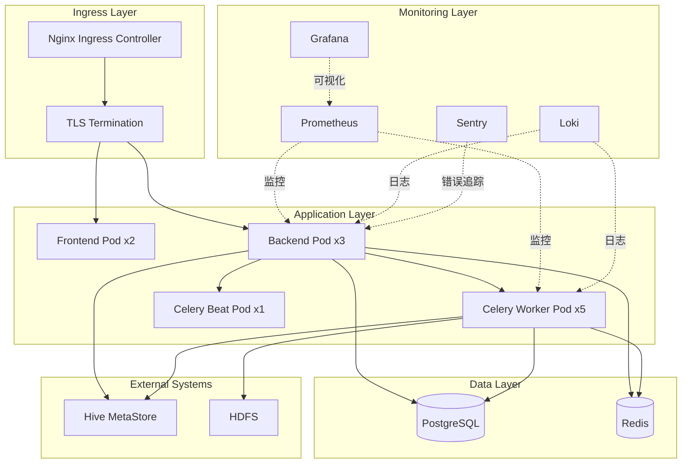
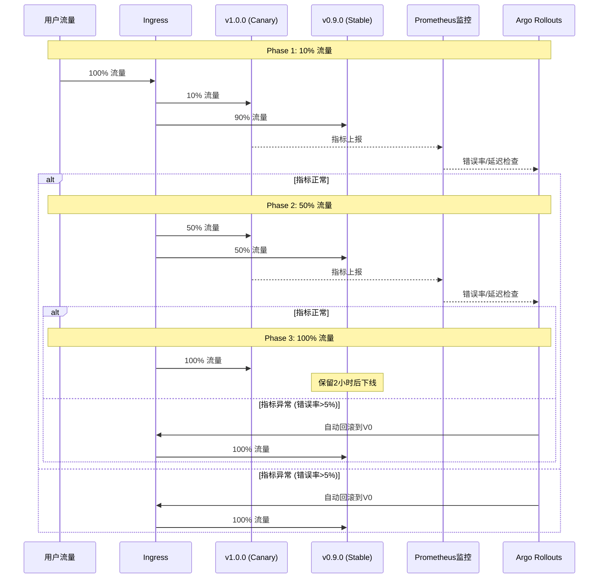
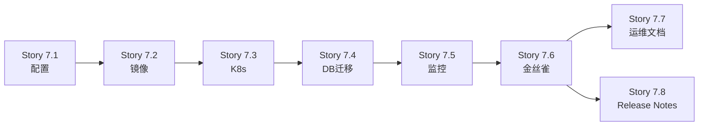

# Epic-7: v1.0生产发布准备 (v1.0 Production Release Preparation)

**Epic ID**: Epic-7
**Epic名称**: v1.0生产发布准备
**优先级**: P0 (v1.0.0阻塞项)
**状态**: 待开始
**创建日期**: 2025-10-12
**预计工作量**: 6天
**责任人**: Dev Team
**依赖**: Epic-6扩展完成 (Stories 6.10-6.12)

---

## 1. Epic目标

为Hive小文件治理平台v1.0.0生产部署建立完整的DevOps基础设施、监控体系和运维文档,确保生产环境稳定、可观测、可运维。

---

## 2. 业务背景

### 当前状态
- ✅ 核心产品功能已完成 (Epic 1-5)
- ✅ 代码重构达标 (Epic-6 v2.0: 复杂度71→57, -19.7%)
- ✅ 单元测试覆盖 (53个测试全部通过)

### 发现的差距
虽然产品功能已完成,但缺失生产发布准备:
- ❌ 无生产环境配置文件
- ❌ 无Docker生产镜像优化
- ❌ 无K8s生产部署清单
- ❌ 无监控告警系统
- ❌ 无数据库迁移验证流程
- ❌ 无金丝雀发布计划
- ❌ 无完整运维文档
- ❌ 无CHANGELOG和Release Notes

### 业务影响
- 🔴 **阻塞v1.0.0生产发布** - 缺失生产部署配置和监控,上线风险高
- 🟡 **运维成本高** - 缺失运维文档,部署和故障处理依赖人工经验
- 🟡 **故障恢复慢** - 无监控告警,问题发现和定位效率低

---

## 3. Epic范围

### 3.1 包含的Story

| Story | 任务 | 工作量 | 优先级 |
|-------|------|--------|--------|
| 7.1 | 生产环境配置 | 0.5天 | P0 |
| 7.2 | Docker生产镜像构建 | 0.5天 | P0 |
| 7.3 | K8s生产部署配置 | 1天 | P0 |
| 7.4 | 数据库迁移验证 | 0.5天 | P0 |
| 7.5 | 监控告警配置 | 1天 | P0 |
| 7.6 | 金丝雀发布计划 | 0.5天 | P0 |
| 7.7 | 运维文档编写 | 1天 | P0 |
| 7.8 | Release Notes和CHANGELOG | 0.5天 | P0 |

**总工作量**: 6天

### 3.2 不包含的内容 (延后到v1.1或v2.0)

- ❌ 用户权限管理 (RBAC) → Epic-8 (v1.1)
- ❌ 高级监控和告警 (APM, Tracing) → Epic-9 (v1.1)
- ❌ 更多合并策略 (INSERT OVERWRITE) → Epic-3扩展 (v1.1)
- ❌ 性能优化 (大表支持 > 10000分区) → v1.1
- ❌ 多租户隔离 → v2.0

---

## 4. Story详细说明

### Story 7.1: 生产环境配置

**任务目标**: 创建完整的生产环境配置文件

**验收标准**:
- [x] 创建 `backend/.env.production` (包含数据库、Redis、Celery、CORS、日志、监控、安全配置)
- [x] 创建 `config/production.yaml` (包含Hive、Celery、扫描、监控参数)
- [x] 所有敏感信息使用环境变量或K8s Secret
- [x] 生产配置与开发配置完全隔离
- [x] 配置文件通过schema验证

**技术栈**: Python配置管理, YAML, K8s Secrets

**交付物**:
- `backend/.env.production.example`
- `config/production.yaml`
- `docs/operations/configuration-guide.md`

---

### Story 7.2: Docker生产镜像构建

**任务目标**: 构建优化的生产Docker镜像

**验收标准**:
- [x] Backend Dockerfile.prod 采用多阶段构建
- [x] Frontend Dockerfile.prod 使用Nginx alpine镜像
- [x] 镜像大小 < 500MB (backend), < 50MB (frontend)
- [x] 镜像安全扫描无高危漏洞 (Trivy)
- [x] 健康检查正常响应
- [x] 非root用户运行
- [x] docker-compose.prod.yml 配置多副本和资源限制

**技术栈**: Docker, Docker Compose, Trivy

**交付物**:
- `backend/Dockerfile.prod`
- `frontend/Dockerfile.prod`
- `docker-compose.prod.yml`
- `scripts/build/build_images.sh`

---

### Story 7.3: K8s生产部署配置

**任务目标**: 创建K8s生产部署配置 (使用Helm)

**验收标准**:
- [x] Helm Chart通过lint检查
- [x] values.yaml包含完整的生产配置
- [x] Backend副本数=3, Celery Worker副本数=5
- [x] 配置HPA (CPU > 70%自动扩容)
- [x] 配置PDB (确保滚动更新零停机)
- [x] 配置Ingress (HTTPS + TLS)
- [x] 在测试环境成功部署验证

**技术栈**: Kubernetes, Helm 3, Nginx Ingress

**交付物**:
- `k8s/helm/hive-platform/` (完整Helm Chart)
  - Chart.yaml
  - values.yaml
  - templates/ (deployment, service, ingress, hpa, pdb, configmap, secret)
- `scripts/deploy/deploy_k8s.sh`

---

### Story 7.4: 数据库迁移验证

**任务目标**: 验证数据库迁移脚本的生产安全性

**验收标准**:
- [x] 所有迁移脚本幂等性验证通过
- [x] 大表迁移 < 5分钟 (模拟100万扫描记录)
- [x] 索引创建使用CONCURRENTLY (避免锁表)
- [x] 备份恢复流程测试成功
- [x] 无数据丢失或损坏

**技术栈**: Alembic, PostgreSQL, Bash

**交付物**:
- `scripts/db/validate_migrations.py`
- `scripts/db/backup_restore_test.sh`
- `docs/operations/database-migration-guide.md`

---

### Story 7.5: 监控告警配置

**任务目标**: 部署完整的监控告警系统

**验收标准**:
- [x] Prometheus Operator成功部署
- [x] Grafana Dashboard正常展示 (system, application, business)
- [x] Sentry成功捕获测试异常
- [x] Loki日志聚合正常工作
- [x] 模拟P0告警触发,通知正常发送 (钉钉/Slack/Email)
- [x] 所有监控指标采集正常 (系统/应用/业务)

**技术栈**: Prometheus, Grafana, Sentry, Loki, Promtail

**交付物**:
- `k8s/monitoring/prometheus-operator.yaml`
- `k8s/monitoring/alerting-rules.yaml`
- `k8s/monitoring/grafana-dashboards/` (3个dashboard JSON)
- `backend/app/monitoring/prometheus_metrics.py`
- `backend/app/monitoring/sentry_integration.py`
- `docs/operations/monitoring-guide.md`

---

### Story 7.6: 金丝雀发布计划

**任务目标**: 制定金丝雀发布策略和回滚预案

**验收标准**:
- [x] Argo Rollouts配置通过验证
- [x] 金丝雀发布策略定义清晰 (10% → 50% → 100%)
- [x] 自动回滚条件配置 (错误率 > 5% OR P95延迟增加 > 50%)
- [x] 在测试环境模拟金丝雀发布成功
- [x] 模拟自动回滚正常触发
- [x] 手动回滚脚本测试 < 1分钟完成

**技术栈**: Argo Rollouts, K8s, Bash

**交付物**:
- `k8s/rollout/backend-rollout.yaml`
- `k8s/rollout/canary-service.yaml`
- `scripts/release/rollback.sh`
- `docs/operations/canary-release-runbook.md`

---

### Story 7.7: 运维文档编写

**任务目标**: 编写完整的运维文档集

**验收标准**:
- [x] 所有文档经过技术审查
- [x] 文档中的命令和步骤经过实际测试
- [x] 文档包含清晰的截图和示例
- [x] 运维团队确认文档可操作性

**技术栈**: Markdown

**交付物**:
- `docs/operations/deployment-guide.md` (部署指南)
- `docs/operations/upgrade-guide.md` (升级指南)
- `docs/operations/troubleshooting-guide.md` (故障排查)
- `docs/operations/monitoring-guide.md` (监控运维)

**工作量**: 6.5小时
- deployment-guide.md: 2小时
- upgrade-guide.md: 1小时
- troubleshooting-guide.md: 2小时
- monitoring-guide.md: 1.5小时

---

### Story 7.8: Release Notes和CHANGELOG

**任务目标**: 编写v1.0.0 Release Notes和CHANGELOG

**验收标准**:
- [x] CHANGELOG遵循Keep a Changelog格式
- [x] Release Notes包含所有主要特性
- [x] 文档经过产品和技术团队审查
- [x] 已知问题和升级路径清晰说明

**技术栈**: Markdown

**交付物**:
- `CHANGELOG.md` (项目根目录)
- `docs/release/v1.0.0-release-notes.md`

**工作量**: 1小时
- CHANGELOG.md: 0.5小时
- v1.0.0-release-notes.md: 0.5小时

---

## 5. 技术架构

### 5.1 生产部署架构



### 5.2 金丝雀发布流程



---

## 6. 依赖关系

### 6.1 前置依赖

- Epic-6扩展完成 (Stories 6.10-6.12)
  - Story 6.10: QA质量门审查通过
  - Story 6.11: E2E回归测试100%通过
  - Story 6.12: 性能基线建立完成

### 6.2 Epic内部依赖



### 6.3 外部依赖

- K8s集群环境 (最小3 nodes, 4C8G)
- Docker Registry (镜像存储)
- 钉钉/Slack/Email (告警通知渠道)
- 运维团队 (文档审查和发布配合)

---

## 7. 风险与缓解措施

| 风险ID | 风险描述 | 概率 | 影响 | 缓解措施 |
|--------|----------|------|------|----------|
| R1 | K8s部署配置复杂,调试耗时 | 中 | 中 | 使用Helm简化,参考成熟Chart模板 |
| R2 | 监控配置耗时超预期 | 低 | 低 | 使用Prometheus Operator快速部署 |
| R3 | 运维文档审查不通过 | 低 | 中 | 提前与运维团队沟通需求,迭代修改 |
| R4 | 数据库迁移失败 | 低 | 高 | Story 7.4完整测试备份恢复流程 |
| R5 | 金丝雀发布模拟失败 | 低 | 中 | Story 7.6在测试环境充分验证 |
| R6 | 镜像安全扫描发现高危漏洞 | 中 | 中 | 及时更新依赖包版本,使用官方基础镜像 |

---

## 8. 成功标准 (Definition of Done)

### Epic级别DoD:
- [x] 所有8个Story完成并通过验收
- [x] 生产配置文件就绪 (.env.production, values.yaml)
- [x] Docker生产镜像构建成功 (backend, frontend)
- [x] Helm Chart部署测试通过
- [x] 数据库迁移验证通过 (包括备份恢复)
- [x] Prometheus + Grafana + Sentry全部运行
- [x] 金丝雀发布模拟成功 (包括自动回滚)
- [x] 运维文档完成并通过运维团队审查
- [x] CHANGELOG和Release Notes完成并通过产品审查

### v1.0.0发布就绪标准:
- [x] Epic-6扩展 + Epic-7全部完成
- [x] 所有自动化测试通过 (单元/集成/E2E)
- [x] 所有性能指标达标
- [x] 所有文档完成并审查通过
- [x] 测试环境金丝雀发布演练成功
- [x] 运维团队确认准备就绪
- [x] 产品团队批准发布

---

## 9. 时间线

```
Day 1 (2025-10-13):
  - Story 7.1: 生产环境配置 (完成)
  - Story 7.2: Docker生产镜像 (完成)

Day 2 (2025-10-14):
  - Story 7.3: K8s部署配置 (进行中)

Day 3 (2025-10-15):
  - Story 7.3: K8s部署配置 (完成)
  - Story 7.4: 数据库迁移验证 (完成)

Day 4 (2025-10-16):
  - Story 7.5: 监控告警配置 (进行中)

Day 5 (2025-10-17):
  - Story 7.5: 监控告警配置 (完成)
  - Story 7.6: 金丝雀发布计划 (完成)

Day 6 (2025-10-18):
  - Story 7.7: 运维文档 (进行中)
  - Story 7.8: Release Notes (进行中)

预计完成: 2025-10-18
Epic-7完成后: v1.0.0 Release Ready 🎉
```

---

## 10. 参考文档

- [Sprint Change Proposal](../qa/sprint-change-proposal-2025-10-12.md)
- [Epic-6 v2.0 PRD](./epic-006-refactoring-v2.md)
- [Architecture Document](../architecture.md)
- [PRD](../prd.md)

---

**Epic Owner**: Dev Team
**PM**: PM Agent (John)
**创建日期**: 2025-10-12
**最后更新**: 2025-10-12
**版本**: v1.0
