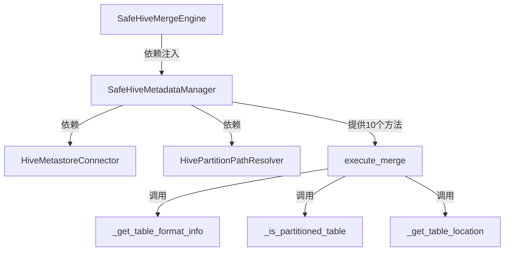

# Story 6.1: 提取MetadataManager模块

**Story ID**: EPIC-6-STORY-001
**Epic**: EPIC-6 代码重构(技术债治理)
**优先级**: P0 (Must Do First)
**预计工期**: 2天
**状态**: 📋 待开始
**负责人**: TBD

---

## 1. User Story

**作为**开发者,
**我希望**将safe_hive_engine.py中的元数据管理逻辑提取为独立的MetadataManager模块,
**以便**提高代码可维护性,降低核心文件复杂度,避免重复上次重构失败。

---

## 2. 业务价值

### 2.1 当前问题
- safe_hive_engine.py文件4228行,严重违反<500行规范
- 元数据管理逻辑(10个方法,~900行)与合并逻辑耦合
- 上次重构失败(commit 840f29b)教训:方法签名不匹配、依赖缺失

### 2.2 Story目标
- 提取10个元数据相关方法为独立模块
- 保持方法签名100%一致(包括关键字参数和默认值)
- 为后续4个模块提取打下基础
- 单元测试覆盖率>80%

### 2.3 成功指标
- [ ] MetadataManager模块独立可测试
- [ ] safe_hive_engine.py成功引入并调用MetadataManager
- [ ] 所有现有测试通过(回归测试)
- [ ] 代码覆盖率>80%

---

## 3. 验收标准 (Acceptance Criteria)

### AC-1: 创建独立模块文件
- [ ] 创建`backend/app/engines/safe_hive_metadata_manager.py`
- [ ] 文件包含`SafeHiveMetadataManager`类
- [ ] 类文档字符串清晰描述职责

### AC-2: 提取10个元数据方法 (基于/tmp/safe_hive_engine_documented.md)

**必须提取的方法** (方法签名必须100%一致):

1. **`_get_table_location(database_name: str, table_name: str) -> Optional[str]`**
   - 获取表的HDFS路径
   - 依赖: HiveMetastoreConnector

2. **`_table_exists(database_name: str, table_name: str) -> bool`**
   - 检查表是否存在
   - 依赖: HiveMetastoreConnector

3. **`_is_partitioned_table(database_name: str, table_name: str) -> bool`**
   - 检查是否为分区表
   - 依赖: HiveMetastoreConnector

4. **`_get_table_partitions(database_name: str, table_name: str) -> List[str]`**
   - 获取表的所有分区
   - 依赖: HiveMetastoreConnector

5. **`_get_table_format_info(database_name: str, table_name: str) -> Dict[str, Any]`**
   - 获取表的格式信息(TEXTFILE/ORC/PARQUET等)
   - 返回格式: `{"InputFormat": str, "OutputFormat": str, "SerdeInfo": dict}`

6. **`_get_table_columns(database_name: str, table_name: str) -> Tuple[List[str], List[str]]`**
   - 获取表的列信息
   - 返回: (普通列列表, 分区列列表)

7. **`_is_unsupported_table_type(fmt: Dict) -> bool`**
   - 检查表格式是否不支持合并
   - 参数fmt: 来自_get_table_format_info的返回值

8. **`_unsupported_reason(fmt: Dict) -> str`**
   - 返回不支持的原因描述
   - 参数fmt: 来自_get_table_format_info的返回值

9. **`_infer_storage_format_name(fmt: Dict) -> str`**
   - 推断存储格式名称(TEXTFILE/ORC/PARQUET)
   - 参数fmt: 来自_get_table_format_info的返回值

10. **`_infer_table_compression(fmt: Dict, storage_format: str) -> str`**
    - 推断表的压缩格式(SNAPPY/GZIP/LZO等)
    - 参数:
      - fmt: 来自_get_table_format_info的返回值
      - storage_format: 来自_infer_storage_format_name的返回值

**关键要求**:
- ✅ 方法签名100%一致(参数名、类型、默认值)
- ✅ 返回值类型100%一致
- ✅ 异常处理逻辑100%保留
- ✅ 日志记录逻辑100%保留

### AC-3: 依赖注入

**构造函数签名**:
```python
class SafeHiveMetadataManager:
    def __init__(
        self,
        hive_connector: HiveMetastoreConnector,
        path_resolver: HivePartitionPathResolver
    ):
        self.hive_connector = hive_connector
        self.path_resolver = path_resolver
```

**依赖清单**:
- `HiveMetastoreConnector`: Hive MetaStore连接器
- `HivePartitionPathResolver`: 分区路径解析器

### AC-4: 单元测试

**测试文件**: `backend/tests/engines/test_safe_hive_metadata_manager.py`

**必须覆盖的测试场景**:
1. 测试_get_table_location - 正常表
2. 测试_get_table_location - 表不存在
3. 测试_table_exists - 存在/不存在
4. 测试_is_partitioned_table - 分区表/非分区表
5. 测试_get_table_partitions - 有分区/无分区
6. 测试_get_table_format_info - TEXTFILE/ORC/PARQUET
7. 测试_get_table_columns - 包含分区列
8. 测试_is_unsupported_table_type - 不支持的格式
9. 测试_infer_storage_format_name - 各种格式推断
10. 测试_infer_table_compression - 各种压缩推断

**覆盖率要求**: >80%

### AC-5: 主引擎集成

**修改safe_hive_engine.py**:
```python
class SafeHiveMergeEngine:
    def __init__(self, cluster_id: int):
        # ... 现有代码 ...

        # 新增: 依赖注入MetadataManager
        self.metadata_manager = SafeHiveMetadataManager(
            hive_connector=self.hive_connector,
            path_resolver=self.path_resolver
        )

    def execute_merge(self, task: MergeTask, db_session: Session) -> Dict[str, Any]:
        # 替换所有self._get_table_location调用为:
        # self.metadata_manager._get_table_location(...)

        # 替换所有self._is_partitioned_table调用为:
        # self.metadata_manager._is_partitioned_table(...)

        # ... 其他8个方法同理 ...
```

**关键检查点**:
- [ ] safe_hive_engine.py中删除10个原方法
- [ ] 所有调用点修改为`self.metadata_manager.方法名(...)`
- [ ] execute_merge的3个分支逻辑不受影响

### AC-6: 回归测试

**必须通过的现有测试**:
- [ ] `test_execute_merge_non_partitioned_table` (整表合并)
- [ ] `test_execute_merge_with_partition_filter` (分区级合并)
- [ ] `test_execute_merge_full_table_partitioned` (分区表整表合并)
- [ ] `test_validate_task` (任务验证)

**如果测试失败**:
- 立即回滚修改
- 分析失败原因
- 修复后重新测试

---

## 4. 技术实现要点

### 4.1 方法提取步骤 (防止上次失败)

**Step 1: 提取前准备**
1. 备份safe_hive_engine.py: `cp safe_hive_engine.py safe_hive_engine.py.backup`
2. 运行所有现有测试,确保当前状态正常
3. 使用mypy检查类型注解: `mypy backend/app/engines/safe_hive_engine.py`

**Step 2: 创建新模块**
1. 创建`safe_hive_metadata_manager.py`
2. 复制(不是移动)10个方法到新文件
3. 添加类型注解和文档字符串
4. 实现构造函数依赖注入

**Step 3: 编写单元测试**
1. 创建`test_safe_hive_metadata_manager.py`
2. 为10个方法编写独立测试
3. 使用Mock隔离依赖(HiveMetastoreConnector)
4. 运行测试: `pytest backend/tests/engines/test_safe_hive_metadata_manager.py -v`

**Step 4: 集成到主引擎**
1. 在safe_hive_engine.py的__init__中注入MetadataManager
2. 逐个替换方法调用(self._xxx -> self.metadata_manager._xxx)
3. 每替换5个方法,运行一次回归测试
4. 全部替换完成后,删除原10个方法

**Step 5: 验证**
1. 运行所有单元测试: `pytest backend/tests/engines/ -v`
2. 运行覆盖率检查: `pytest --cov=backend/app/engines/safe_hive_metadata_manager`
3. 运行mypy静态检查: `mypy backend/app/engines/`
4. 运行E2E测试(如果有)

### 4.2 关键风险点

**风险-1: 方法签名不匹配** (上次失败原因#3)
- **示例**: 上次使用了keyword-only参数,但主引擎传位置参数
- **缓解**: 逐行对照`/tmp/safe_hive_engine_documented.md`中的签名
- **验证**: 使用mypy静态检查

**风险-2: 依赖方法遗漏** (上次失败原因#4)
- **示例**: `_get_table_format_info`可能调用其他私有方法
- **缓解**: 使用IDE的"Find Usages"找到所有依赖
- **验证**: 单元测试覆盖所有调用路径

**风险-3: execute_merge调用路径破坏** (上次失败原因#1)
- **示例**: execute_merge的3个分支可能调用元数据方法
- **缓解**: 为execute_merge编写完整集成测试(先于提取)
- **验证**: 回归测试覆盖3个分支

### 4.3 依赖关系图



---

## 5. 测试设计

### 5.1 单元测试用例 (基于BMAD QA要求)

**测试文件**: `backend/tests/engines/test_safe_hive_metadata_manager.py`

```python
import pytest
from unittest.mock import Mock, MagicMock
from backend.app.engines.safe_hive_metadata_manager import SafeHiveMetadataManager

class TestSafeHiveMetadataManager:
    @pytest.fixture
    def mock_hive_connector(self):
        return Mock()

    @pytest.fixture
    def mock_path_resolver(self):
        return Mock()

    @pytest.fixture
    def metadata_manager(self, mock_hive_connector, mock_path_resolver):
        return SafeHiveMetadataManager(
            hive_connector=mock_hive_connector,
            path_resolver=mock_path_resolver
        )

    # 测试用例1: _get_table_location - 正常表
    def test_get_table_location_success(self, metadata_manager, mock_hive_connector):
        # Given
        mock_hive_connector.get_table_location.return_value = "/user/hive/warehouse/test_db.db/test_table"

        # When
        result = metadata_manager._get_table_location("test_db", "test_table")

        # Then
        assert result == "/user/hive/warehouse/test_db.db/test_table"
        mock_hive_connector.get_table_location.assert_called_once_with("test_db", "test_table")

    # 测试用例2: _get_table_location - 表不存在
    def test_get_table_location_not_exists(self, metadata_manager, mock_hive_connector):
        # Given
        mock_hive_connector.get_table_location.return_value = None

        # When
        result = metadata_manager._get_table_location("test_db", "non_exist_table")

        # Then
        assert result is None

    # 测试用例3: _is_partitioned_table - 分区表
    def test_is_partitioned_table_true(self, metadata_manager, mock_hive_connector):
        # Given
        mock_hive_connector.get_partitions.return_value = ["dt=2025-10-11", "dt=2025-10-12"]

        # When
        result = metadata_manager._is_partitioned_table("test_db", "partitioned_table")

        # Then
        assert result is True

    # 测试用例4: _get_table_format_info - ORC格式
    def test_get_table_format_info_orc(self, metadata_manager, mock_hive_connector):
        # Given
        mock_hive_connector.get_table_format.return_value = {
            "InputFormat": "org.apache.hadoop.hive.ql.io.orc.OrcInputFormat",
            "OutputFormat": "org.apache.hadoop.hive.ql.io.orc.OrcOutputFormat",
            "SerdeInfo": {"serializationLib": "org.apache.hadoop.hive.ql.io.orc.OrcSerde"}
        }

        # When
        result = metadata_manager._get_table_format_info("test_db", "orc_table")

        # Then
        assert "OrcInputFormat" in result["InputFormat"]
        assert result["SerdeInfo"]["serializationLib"].endswith("OrcSerde")

    # 测试用例5: _infer_storage_format_name - PARQUET
    def test_infer_storage_format_parquet(self, metadata_manager):
        # Given
        fmt = {
            "InputFormat": "org.apache.hadoop.hive.ql.io.parquet.MapredParquetInputFormat",
            "OutputFormat": "org.apache.hadoop.hive.ql.io.parquet.MapredParquetOutputFormat"
        }

        # When
        result = metadata_manager._infer_storage_format_name(fmt)

        # Then
        assert result == "PARQUET"

    # ... 继续5-10个测试用例 ...
```

**覆盖率目标**: 每个方法至少2个测试用例,总覆盖率>80%

### 5.2 集成测试用例 (safe_hive_engine.py)

**测试场景**: 验证MetadataManager集成后execute_merge正常工作

```python
def test_execute_merge_with_metadata_manager(self, mock_engine):
    # Given: 创建合并任务
    task = MergeTask(
        database="test_db",
        table="test_table",
        partition_filter=None,
        target_format="ORC"
    )

    # When: 执行合并
    result = mock_engine.execute_merge(task, db_session)

    # Then: 验证调用了MetadataManager方法
    mock_engine.metadata_manager._get_table_format_info.assert_called()
    mock_engine.metadata_manager._is_partitioned_table.assert_called()
    assert result["success"] is True
```

---

## 6. DoD (Definition of Done)

### 代码完成标准
- [ ] SafeHiveMetadataManager类创建并通过mypy检查
- [ ] 10个方法提取完成,签名100%一致
- [ ] safe_hive_engine.py成功集成MetadataManager
- [ ] safe_hive_engine.py删除原10个方法

### 测试完成标准
- [ ] 单元测试覆盖率>80%
- [ ] 所有单元测试通过
- [ ] 所有回归测试通过
- [ ] 集成测试通过

### 文档完成标准
- [ ] SafeHiveMetadataManager类文档字符串完整
- [ ] 10个方法文档字符串完整
- [ ] 更新architecture.md(如需要)

### 质量门禁
- [ ] Mypy静态检查通过
- [ ] Pre-commit Hook通过
- [ ] Code Review通过
- [ ] BMAD QA评审通过(`/BMadqa *review`)

---

## 7. 参考资料

### 关键文档
- **方法签名参考**: `/tmp/safe_hive_engine_documented.md` (Section A - MetadataManager)
- **上次失败分析**: Git commit 840f29b
- **BMAD Brownfield指南**: `.bmad-core/working-in-the-brownfield.md`
- **测试规范**: `docs/architecture.md` 第9章

### 相关代码
- **主引擎文件**: `backend/app/engines/safe_hive_engine.py`
- **依赖接口**: `backend/app/engines/connection_manager.py`
- **路径解析器**: `backend/app/engines/hive_partition_path_resolver.py`

---

## 8. 时间线

| 阶段 | 任务 | 时间 |
|-----|-----|------|
| Day 1 上午 | 创建模块+提取方法+编写单元测试 | 4小时 |
| Day 1 下午 | 运行单元测试+修复Bug | 4小时 |
| Day 2 上午 | 集成到主引擎+回归测试 | 4小时 |
| Day 2 下午 | 代码审查+文档补充+QA评审 | 4小时 |

**总工时**: 2天 (16小时)

---

**Story创建时间**: 2025-10-12
**Story负责人**: TBD
**Epic负责人**: TBD
**下次评审**: Sprint Planning
