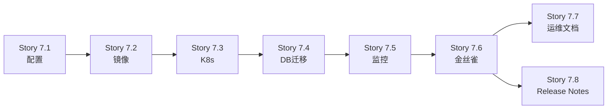

# Epic-7 Stories索引

**Epic**: Epic-7 (v1.0生产发布准备)
**优先级**: P0
**工作量**: 6天
**状态**: 待开始

---

## Story列表

所有Story的详细说明请参见 [Epic-7 PRD](../../epics/epic-007-production-release.md#4-story详细说明)

| Story | 任务 | 工作量 | 状态 | 文档链接 |
|-------|------|--------|------|----------|
| 7.1 | 生产环境配置 | 0.5天 | 待开始 | [详见Epic-7 PRD §4-Story 7.1](../../epics/epic-007-production-release.md#story-71-生产环境配置) |
| 7.2 | Docker生产镜像构建 | 0.5天 | 待开始 | [详见Epic-7 PRD §4-Story 7.2](../../epics/epic-007-production-release.md#story-72-docker生产镜像构建) |
| 7.3 | K8s生产部署配置 | 1天 | 待开始 | [详见Epic-7 PRD §4-Story 7.3](../../epics/epic-007-production-release.md#story-73-k8s生产部署配置) |
| 7.4 | 数据库迁移验证 | 0.5天 | 待开始 | [详见Epic-7 PRD §4-Story 7.4](../../epics/epic-007-production-release.md#story-74-数据库迁移验证) |
| 7.5 | 监控告警配置 | 1天 | 待开始 | [详见Epic-7 PRD §4-Story 7.5](../../epics/epic-007-production-release.md#story-75-监控告警配置) |
| 7.6 | 金丝雀发布计划 | 0.5天 | 待开始 | [详见Epic-7 PRD §4-Story 7.6](../../epics/epic-007-production-release.md#story-76-金丝雀发布计划) |
| 7.7 | 运维文档编写 | 1天 | 待开始 | [详见Epic-7 PRD §4-Story 7.7](../../epics/epic-007-production-release.md#story-77-运维文档编写) |
| 7.8 | Release Notes和CHANGELOG | 0.5天 | 待开始 | [详见Epic-7 PRD §4-Story 7.8](../../epics/epic-007-production-release.md#story-78-release-notes和changelog) |

---

## 快速导航

### Story分类

**配置和镜像** (Day 1):
- [Story 7.1: 生产环境配置](../../epics/epic-007-production-release.md#story-71-生产环境配置)
- [Story 7.2: Docker生产镜像构建](../../epics/epic-007-production-release.md#story-72-docker生产镜像构建)

**部署和迁移** (Day 2-3):
- [Story 7.3: K8s生产部署配置](../../epics/epic-007-production-release.md#story-73-k8s生产部署配置)
- [Story 7.4: 数据库迁移验证](../../epics/epic-007-production-release.md#story-74-数据库迁移验证)

**监控和发布** (Day 4-5):
- [Story 7.5: 监控告警配置](../../epics/epic-007-production-release.md#story-75-监控告警配置)
- [Story 7.6: 金丝雀发布计划](../../epics/epic-007-production-release.md#story-76-金丝雀发布计划)

**文档** (Day 6):
- [Story 7.7: 运维文档编写](../../epics/epic-007-production-release.md#story-77-运维文档编写)
- [Story 7.8: Release Notes和CHANGELOG](../../epics/epic-007-production-release.md#story-78-release-notes和changelog)

---

## 依赖关系



---

## 开始执行

在开始执行Epic-7之前,请确保:
- [x] Epic-6 Stories 6.10-6.12全部完成
- [x] QA质量门通过
- [x] E2E回归测试100%通过
- [x] 性能基线建立完成

**开始第一个Story**:
```bash
# 查看Story 7.1详细说明
cat docs/epics/epic-007-production-release.md | grep -A 50 "Story 7.1"

# 开始执行
# 1. 创建 backend/.env.production
# 2. 创建 config/production.yaml
# 3. 验证配置文件
```

---

**维护者**: Dev Team
**最后更新**: 2025-10-12
