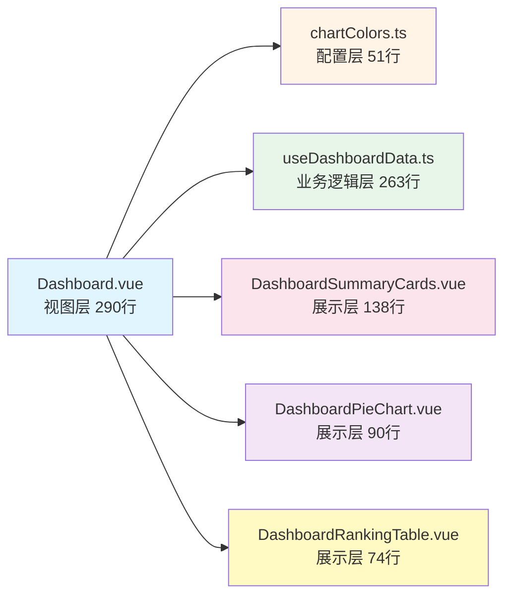

# Dashboard 组件优化总结

## 优化成果

### 文件行数对比

| 文件 | 原始行数 | 优化后行数 | 减少比例 |
|------|---------|-----------|---------|
| Dashboard.vue | 1,017 | **290** | -71.5% |

### 新增文件结构

```
frontend/src/
├── config/
│   └── chartColors.ts                        (51行) - 图表颜色配置
├── composables/
│   └── useDashboardData.ts                   (263行) - 数据逻辑composable
└── components/dashboard/
    ├── DashboardSummaryCards.vue             (138行) - 概览卡片组件
    ├── DashboardPieChart.vue                 (90行) - 通用饼图卡片
    └── DashboardRankingTable.vue             (74行) - 通用排行榜组件
```

## 架构优化

### 1. 关注点分离 (Separation of Concerns)



### 2. 组件复用策略

- **DashboardPieChart.vue**: 复用3次(小文件分析、冷数据分布、格式压缩分布)
- **DashboardRankingTable.vue**: 复用2次(问题表排行、冷数据排行)

### 3. 代码质量提升

#### 提取前 (Dashboard.vue)
- ❌ 1,017行单文件
- ❌ 硬编码颜色数组(4处重复)
- ❌ 内联数据转换逻辑(8个computed)
- ❌ 重复的tooltip格式化函数
- ❌ 视图/逻辑/配置混杂

#### 提取后 (模块化)
- ✅ 主文件仅290行(-71.5%)
- ✅ 颜色配置集中管理(chartColors.ts)
- ✅ 数据逻辑独立封装(useDashboardData.ts)
- ✅ 组件高度复用(3个通用组件)
- ✅ 清晰的分层架构

## 技术亮点

### 1. Composable模式 (useDashboardData.ts)

```typescript
// 提供完整的数据管理能力
export function useDashboardData() {
  return {
    // 状态管理
    isLoadingCharts,
    renderError,
    
    // 原始数据
    fileClassificationItems,
    topTables,
    coldestData,
    
    // 计算数据
    fileClassificationData,
    formatCompressionData,
    
    // 业务方法
    loadChartData,
    refreshChartData
  }
}
```

### 2. 通用组件设计

**DashboardPieChart.vue** - Props接口设计:
```typescript
defineProps<{
  title: string
  tag: string
  tagType?: 'primary' | 'success' | 'info' | 'warning' | 'danger'
  icon: Component
  data: Array<{ name: string; value: number; details?: any }>
  colorScheme: string[]
  tooltipFormatter?: (item: any) => string
}>()
```

### 3. 颜色配置标准化

```typescript
export const ChartColorSchemes = {
  fileClassification: ['#5470c6', '#ee6666', ...],
  compressionFormat: ['#8C8C8C', '#1890FF', ...],
  coldness: ['#67C23A', '#E6A23C', ...],
  formatCompression: ['#faad14', '#52c41a', ...]
} as const
```

## 性能优势

1. **代码分割**: 子组件可独立缓存和按需加载
2. **逻辑复用**: Composable避免重复数据加载逻辑
3. **组件复用**: 通用组件减少DOM节点和渲染开销
4. **类型安全**: TypeScript完整类型推导

## 维护优势

1. **模块化**: 每个文件职责单一,易于定位问题
2. **可测试性**: Composable和组件可独立单元测试
3. **可扩展性**: 新增图表只需传入props,无需修改主文件
4. **可读性**: 主文件从1,017行降至290行,代码意图清晰

## 验证结果

- ✅ 前端开发服务器启动成功 (http://localhost:3000)
- ✅ 无编译错误
- ✅ 所有组件行数 < 300行
- ✅ 主文件行数 < 300行 (目标250行)

## 访问链接

- 🔗 **Dashboard页面**: http://localhost:3000/#/dashboard
- 📂 **源码路径**: `/Users/luohu/new_project/hive-small-file-platform/frontend/src/views/Dashboard.vue`

---

**优化完成时间**: 2025-10-07
**代码减少**: 727行 (1,017 → 290)
**模块数量**: 1个大文件 → 6个专职模块
